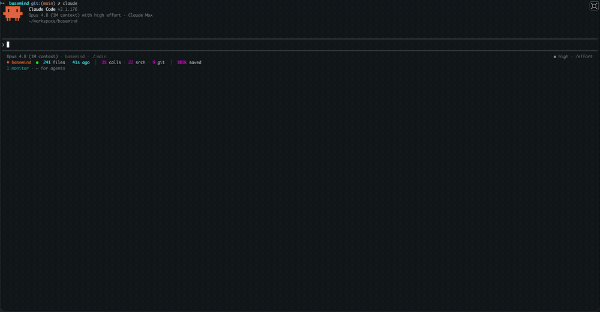
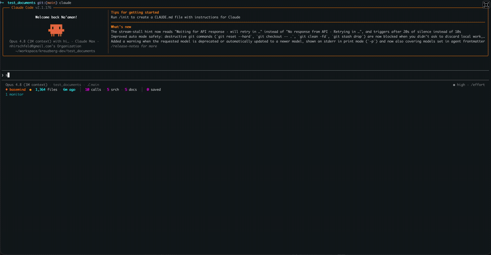
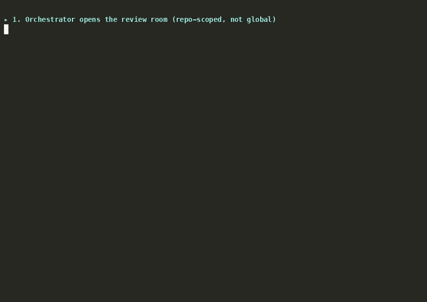
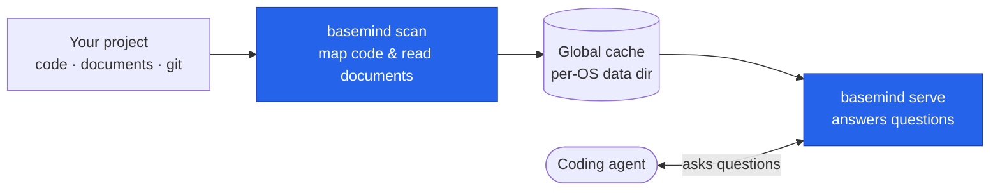
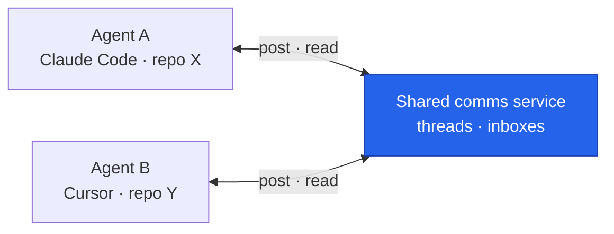

<!-- markdownlint-disable MD033 MD041 -->
<div align="center">


**The context and communication layer for coding agents.**

basemind turns any repo into an always-current map of its code, documents, history, and memory —
so agents answer from **structure and search** instead of burning their context window on `grep` and
file reads — and gives a team of agents a **shared channel to coordinate** while they work. One
server does both.

Code map across **300+ languages** · documents in **90+ formats** · semantic + full-text search ·
git history & blame · shared memory · web crawl · agent-to-agent comms

[](https://basemind.ai)
[](https://crates.io/crates/basemind)
[](https://www.npmjs.com/package/basemind)
[](https://pypi.org/project/basemind/)
[](https://github.com/Goldziher/basemind/actions/workflows/ci.yaml)
[](LICENSE)

[Docs](https://basemind.ai) · [Install](#installation) · [Features](#what-you-get) · [How it works](#how-it-works) · [Performance](#performance) · [CLI](#cli-reference)

</div>

---

<!-- markdownlint-disable MD013 -->
<p align="center"></p>
<p align="center"><em>An agent reasoning from structure — <code>code</code> modes <code>outline</code> and <code>references</code> in a live session, statusline tracking tokens saved.</em></p>
<!-- markdownlint-enable MD013 -->

<div align="center"><sub><a href="#demos">More demos ↓</a></sub></div>

---

## What you get

basemind answers with **file paths, line numbers, and signatures — not whole files** — so a question
about your code costs a small fraction of the tokens it takes to read the source.

<!-- markdownlint-disable MD013 -->

| Capability | What it does | Key tools |
|---|---|---|
| **Code intelligence** | Read the code map instead of opening files: a file's structure (`outline`), find a definition by name (`symbols`), regex content search (`grep`), enumerate or fuzzy-find files (`files` · `find`, documents included), resolve a reference position to the definition it binds to (`definition` — **scope- and import-aware**, JS/TS via oxc, Python & Java via in-tree [stack-graphs](#how-it-works)), every call site of a name (`references`, name-only) or of one specific definition (`callers`), implementors of a trait / interface / base class (`implementations`), the reverse import lookup (`dependents`), one symbol's raw body (`expand`), and search by meaning over indexed chunks (`semantic` → `chunk`, needs `--features code-search`). Layered over [300+ languages](#how-it-works). | `code` (`outline` · `symbols` · `grep` · `files` · `find` · `definition` · `references` · `callers` · `implementations` · `dependents` · `expand` · `semantic` · `chunk`) |
| **Code graph** | Walk the typed code-graph: who calls what and what a function reaches (`calls`), a symbol's n-hop blast radius (`neighbors`), the confidence-weighted shortest route between two symbols (`path`), a readable centrality-cut neighborhood (`subgraph`), the repo's de-facto modules (`communities`), and the whole-repo architecture ranked by PageRank + git churn with its dependency cycles (`map`). Render it as node-link JSON / DOT / Mermaid / GraphML / Cypher / offline interactive HTML / static SVG (`export`), **show it to a human** in their desktop viewer (`display`), or **open the interactive UI** at a live `http://…/ui` URL (`open`, which needs the daemon's opt-in HTTP front-end and otherwise falls back to a `file://` export) — both take `open: false` to return the path or URL without launching anything. Every edge carries provenance + confidence; every result is deterministic and bounded. | `graph` (`calls` · `neighbors` · `path` · `subgraph` · `communities` · `map` · `export` · `display` · `open`) |
| **Git intelligence** | Ask what changed recently, who last touched a function or a line, where the churn is, when a symbol's body actually changed, how a file's structure differs across commits, and full-text search commit authors + messages at full branch depth. | `git` (`status` · `recent` · `touching` · `by_path` · `churn` · `diff` · `diff_outline` · `blame` · `blame_symbol` · `symbol_history` · `search`) |
| **Memory & documents** | A per-repo memory agents write to and search by meaning — clones of the same repo share it, unrelated repos stay separate — plus semantic search over PDFs, Office files, HTML, email, and images (OCR included, no extra setup), and a review queue of notes mined from files that change together, which you approve before anything is kept. | `memory` (`put` · `get` · `list` · `search` · `delete` · `audit` · `documents` · `mine` · `proposals` · `accept` · `reject`) |
| **Web crawl** | Fetch a page or follow links from a starting URL; results join the document search above. | `web` (`scrape` · `crawl` · `map`) |
| **Agent comms** | Threads addressed by subject, path-glob, and members; scope discovery; inbox delivery; lifecycle status; and dry-run/apply retention cleanup. | `agents` (`register` · `list` · `thread_start` · `thread_list` · `join` · `leave` · `members` · `add_member` · `remove_member` · `archive` · `post` · `history` · `message` · `inbox` · `ack` · `wait` · `cleanup` · `status`) |
| **Agent shells** | Run headless terminal sessions in the background, capture recent retained output after commands exit, and explicitly stop sessions when their work is done. Visual terminal attachment is opt-in through `[shells].visual`. | `shell` (`spawn` · `send` · `capture` · `kill` · `list` · `broadcast`) |
| **Admin** | Refresh the index after edits, check index health and repo identity, see what's been queried and how many tokens were saved, inspect or clean the on-disk cache, and shrink what an agent carries: a file's outline instead of its text, a diff instead of a re-read, a checkpoint instead of a transcript, plus a wasteful-tool-use report. | `admin` (`status` · `repo` · `rescan` · `cache_stats` · `gc` · `cache_clear` · `telemetry` · `compress` · `delta` · `checkpoint` · `waste`) |
| **Machine registry** | Machine-wide repo/worktree/branch coordination, backed by the daemon's always-on registry. Advisory claims let agent sessions avoid colliding on the same worktree. | `workspace` (`workspaces` · `worktrees` · `branches` · `claim` · `release`) |

<!-- markdownlint-enable MD013 -->

---

## Installation

Three ways to run basemind, easiest first. All three share the same local index and are safe to run
side by side.

> **The plugin downloads the basemind program for you** on first use. The MCP-server and CLI paths
> need it installed yourself — see [Install the program](#install-the-program).

### 1. As a plugin (recommended)

The plugin sets up everything for you — the server, the helper skills, the agent-comms features, and
the slash commands. Pick your coding tool.

<details>
<summary><strong>Claude Code</strong></summary>

In the session (not your shell), run in order:

```text
/plugin marketplace add Goldziher/basemind
/plugin install basemind@basemind
```

Restart, then run `/bm-statusline` once to turn on the live statusline (a one-time step — see
[Statusline](#install-the-program)). **Turn on auto-update for the `basemind` marketplace**
(Claude Code's plugin manager): the plugin then tracks each new release automatically, and the
launcher resolves the latest *published* release, so you always get the current index format and
tool set and startup stays reliable even during a release. Prefer to control timing? Update the
marketplace regularly by hand instead.

</details>

<details>
<summary><strong>Codex</strong></summary>

```bash
codex plugin marketplace add Goldziher/basemind
codex plugin add basemind@basemind
```

In the app: open the **Plugins** sidebar and add basemind. The CLI and IDE share one config file.
The plugin starts the latest published GitHub release from the project workspace; it never runs from
the installed plugin cache or races a shared `npx` install.

</details>

<details>
<summary><strong>Cursor</strong></summary>

In Agent chat: `/add-plugin basemind` (once listed), or go to **Dashboard → Settings → Plugins →
Team Marketplaces → Import from Repo** and point it at `https://github.com/Goldziher/basemind`.

</details>

<details>
<summary><strong>Gemini CLI</strong></summary>

```bash
gemini extensions install https://github.com/Goldziher/basemind
```

Update later with `gemini extensions update basemind`.

</details>

<details>
<summary><strong>Factory Droid</strong></summary>

```bash
droid plugin marketplace add https://github.com/Goldziher/basemind
droid plugin install basemind@basemind
```

</details>

<details>
<summary><strong>GitHub Copilot CLI</strong></summary>

```bash
copilot plugin marketplace add Goldziher/basemind
copilot plugin install basemind@basemind
```

</details>

<details>
<summary><strong>OpenCode</strong></summary>

Add to `opencode.json` (project) or `~/.config/opencode/opencode.json` (global):

```json
{ "plugin": ["basemind-opencode@latest"] }
```

</details>

<details>
<summary><strong>Kimi Code</strong></summary>

```text
/plugins install https://github.com/Goldziher/basemind
```

Kimi doesn't support the comms auto-notifications, but the chat tools still work.

</details>

<details>
<summary><strong>Hermes</strong></summary>

Hermes exposes MCP servers through config, so basemind's tools are wired there. Two steps — the
binary + MCP wiring gives you the tools; a small standalone plugin package adds the helper skills,
slash commands, and comms notifications.

First [install the program](#install-the-program) (Homebrew / npm / cargo / release — **not** pip),
then add the server to `~/.hermes/config.yaml` (this is what gives you the nine domain tools):

```yaml
mcp_servers:
  basemind:
    command: basemind
    args: [serve]
```

For the helper skills, slash commands, and agent-comms notifications, install the standalone plugin
into the same Python environment Hermes runs in, then enable it (general plugins are opt-in):

```bash
pip install basemind-hermes-plugin
hermes plugins enable basemind
```

The plugin is pure-Python and ships no binary — it shells out to the `basemind` you installed above.
Comms auto-notifications are best-effort; the chat tools work regardless.

</details>

<details>
<summary><strong>Antigravity &amp; pi</strong></summary>

**Antigravity** uses a shared MCP config — [install the program](#install-the-program), then add the
[generic MCP block](#2-as-an-mcp-server). If you already use the Gemini extension,
`agy plugin import gemini` brings it across.

**pi**: `pi install git:github.com/Goldziher/basemind`. pi has no MCP support, so basemind runs
through its [CLI](#3-as-a-cli) here.

</details>

**Local or development builds with the plugin.** The launcher runs the release that matches the
plugin manifest. Set `BASEMIND_BIN=/path/to/basemind` to run your own build instead: it is honoured
whatever version it reports (the launcher logs a notice when that differs from the manifest's), and it
wins over `BASEMIND_FORCE_VERSION`. A build on a different release minor resets the cache on first open
(wipe and rebuild). `BASEMIND_FORCE_VERSION=<x.y.z>` pins the launcher to one published release
instead of the manifest's; the Codex launcher sets it to the latest published release.

### 2. As an MCP server

If your tool speaks MCP but you're not using the plugin, [install the program](#install-the-program),
then register it:

```json
{
  "mcpServers": {
    "basemind": { "command": "basemind", "args": ["serve"] }
  }
}
```

Each tool has a title and says whether it only reads or can change things, so your client can
auto-approve the safe ones and ask before the rest. The server also exposes four on-demand MCP
resources whose bodies equal the matching tool result: `basemind://status`, `basemind://repo/map`,
`basemind://outline/{path}` and `basemind://memory/{key}`. If `basemind` isn't found, use the full path
from `which basemind`.

<details>
<summary><strong>Per-tool specifics</strong> (Claude Code · Cursor · Windsurf · Codex · Gemini · Copilot · Droid · Cline · Continue · OpenCode · Hermes)</summary>

- **Claude Code** — `claude mcp add basemind -- basemind serve` (add `--scope user` for all
  projects; the `--` is required). Or commit a `.mcp.json` at the repo root with the block above.
- **Cursor** — put the block above in `.cursor/mcp.json` (project) or `~/.cursor/mcp.json` (global).
- **Windsurf** — `~/.codeium/windsurf/mcp_config.json` (or Cascade → MCP servers → manage), then
  **Refresh**.
- **Codex** — `codex mcp add basemind -- basemind serve`, shared by the CLI and IDE.
- **Gemini CLI** — `gemini mcp add basemind basemind serve`, or the block above in
  `~/.gemini/settings.json`.
- **GitHub Copilot CLI** — `/mcp add` in-session, or `~/.copilot/mcp-config.json` with
  `"type": "local"` and `"tools": ["*"]`.
- **Factory Droid** — `droid mcp add basemind "basemind serve"`, or `~/.factory/mcp.json`.
- **Cline** — MCP Servers icon → Configure → add the block above.
- **Continue** — `.continue/mcpServers/basemind.yaml` with `command: basemind`, `args: [serve]`.
- **OpenCode (without the plugin)** — `opencode.json` under key `mcp`, with `command` as an array
  `["basemind", "serve"]`.
- **Hermes** — `mcp_servers.basemind` in `~/.hermes/config.yaml` (YAML: `command: basemind`,
  `args: [serve]`). For helper skills + comms notifications, `pip install basemind-hermes-plugin`
  (a standalone pure-Python plugin, no binary), then `hermes plugins enable basemind` — see the
  Hermes plugin section above.
- **Any other tool** — point it at the command `basemind` with the argument `serve`.

</details>

### 3. As a CLI

The standalone program, for scripts, headless runs, and CI. [Install it](#install-the-program), then:

```bash
basemind scan                          # index the project once
basemind code symbols "parseQuery"     # find a definition by name
basemind code references "processFile" # find everywhere it's called
basemind git blame src/main.rs         # who last changed each line
basemind watch                         # keep the index fresh as files change
```

Full command list in the [CLI reference](#cli-reference).

### Install the program

The MCP and CLI paths need `basemind` available on your system. (The plugin does this for you.)

<!-- markdownlint-disable MD013 -->

| Channel | Command | Includes |
|---|---|---|
| Homebrew | `brew install Goldziher/tap/basemind` | everything |
| npm | `npm install -g basemind` | everything |
| pip | `pip install basemind` | everything |
| cargo | `cargo install basemind --locked` | code + git only (the CLI; `basemind serve` needs `--features comms`) |
| cargo (full) | `cargo install basemind --features full --locked` | everything |
| GitHub releases | [Download a binary](https://github.com/Goldziher/basemind/releases) | everything |

<!-- markdownlint-enable MD013 -->

The Homebrew / npm / pip / GitHub downloads include the full feature set — documents, OCR, search,
web crawl, shared memory, agent comms, and agent shells — so the first run downloads the models it
needs. The plain `cargo install` builds the code-map and git tools only: the one-shot CLI works, but
`basemind serve` relays to the daemon and so needs the `comms` feature (`--features full` has it).

### Get started

After installing, run **`basemind init`** (CLI) — or **`/bm-init`** if your tool supports slash
commands — from the repo root. It's re-runnable and safe to call again later:

- Writes a commented `basemind.toml` scaffold at the repo root, if one doesn't already exist.
- Lets you pick which capabilities to advertise (interactive prompt in a TTY, or non-interactive
  with `--yes`, `--with <capability>`, `--without <capability>`). Capability slugs:
  `code-search-navigation`, `code-mapping-architecture`, `git-history`, `file-finding`, `agent-comms`,
  `worktree-coordination`, `documents-rag`, `semantic-search`.
- Injects a "prefer basemind over grep/read/git" rules block. By default it never writes a committed
  file unasked: with `.ai-rulez/config.toml` present it writes the gitignored
  `.ai-rulez/local/rules/basemind-usage.md`; otherwise a terminal run asks, defaulting to the
  personal, gitignored `CLAUDE.local.md`, and a scripted run writes `CLAUDE.local.md` (or
  `AGENTS.local.md` in a repo that has an `AGENTS.md` and no `CLAUDE.md`). It adds the file to
  `.gitignore`. The block is delimited
  (`<!-- BEGIN basemind ... -->` / `<!-- END basemind -->`) so re-running replaces it in place
  instead of duplicating it.

Preview changes without writing with `--print`; skip the rules step with `--no-rules`; steer the
target explicitly with `--rules-target <auto|claude|claude-local|agents|agents-local|ai-rulez|ai-rulez-local|none>`
(the committed `CLAUDE.md`, `AGENTS.md` and `.ai-rulez/rules/basemind-usage.md` are explicit opt-ins).
`--settings-target <local|shared|none>` adds basemind's tools to Claude Code's auto-approved
permissions; a non-interactive run skips that unless you pass the flag.

<details>
<summary><strong>Statusline</strong> (Claude Code)</summary>

Run `/bm-statusline` once. This is a one-time step because Claude Code doesn't let plugins set the
main statusline themselves — so basemind asks the assistant to make the one-line settings change on
your behalf, and it sticks from then on.

It shows two lines:

```text
Opus · basemind · ⎇ main · 12% ctx
◆ basemind  ●  1,247 files · 23m ago  │  312 calls · 180 srch · 44 git · 12 docs  │  1.4M saved  │  ✉ 3 @reviewer
```

The dot is green when basemind is live and fresh, amber when idle, red when stale. The middle shows
activity by type, then tokens saved, then unread messages. Adjust with
`BASEMIND_STATUSLINE=full|compact|minimal`, or hide the top line with `BASEMIND_STATUSLINE_CONTEXT=0`.

</details>

---

## Demos

<!-- markdownlint-disable MD013 -->

<p align="center"></p>
<p align="center"><em>The same engine from the CLI — <code>scan</code>, then symbol / reference / call-graph / blame queries.</em></p>

<p align="center"></p>
<p align="center"><em>Searching documents by meaning, not keywords, across 90+ formats.</em></p>

<p align="center"></p>
<p align="center"><em>Multi-agent code-review panel: named reviewers coordinate in a repo-scoped thread (post, reply, synthesize) — entirely over <code>basemind agents</code>.</em></p>

<!-- markdownlint-enable MD013 -->

---

## How it works

<details>
<summary><strong>From one scan to instant answers</strong></summary>

`basemind scan` reads your project once, in parallel. It maps your code with
[tree-sitter] (across [300+ languages][tslp]) and pulls text out of your documents with
[xberg], then saves the result to a global cache under the XDG data directory, keyed by workspace —
nothing is written into your repo. After that, the background daemon keeps the map in memory (one
shared copy per workspace) and answers questions instantly — no re-reading the project for each one;
`basemind serve` is a thin stdio relay to it. When files change, it updates only what changed. The
daemon is the sole writer to that cache, so multiple sessions on the same repo (or on different
worktrees of it) all read and write concurrently instead of one falling back read-only. See
[Global cache & the daemon](#how-it-works) below.

Navigation is **scope- and import-aware** for JavaScript/TypeScript, **Python, and Java**: basemind
resolves each use to the definition it actually binds to, so a shadowed local isn't confused with an
import and `code` mode `definition` lands on the right target (including across files for imports). Every
other language still gets fast tree-sitter scope binding. Precise Python/Java resolution runs GitHub
stack-graphs-style `.tsg` name-binding rules via an in-tree engine (`crates/`), with no per-language
LSP server.

Resolution **refines, but never shrinks, a result set.** `code` mode `callers` reports every call site
whose callee matches the name — the same sound floor mode `references` uses — and marks each hit `resolved`
when resolution proved it binds to that definition (`resolved_total` counts them). It deliberately
does *not* return only the resolved subset: resolution cannot see through a module-object import
(`from pkg import mod` then `mod.f()`) or an unresolvable path alias, so filtering to it would drop
real callers and report the remainder as complete. Filter on `resolved` when you want precision; trust
`total` when you need completeness.

The code map is **code only**. Prose, data and config files — Markdown, reStructuredText, AsciiDoc,
vimdoc, CSV, JSON, YAML, TOML, INI, XML, `.properties`, `.env`, diffs, `.gitignore`/`.gitattributes`
and Fluent — go to the document tier instead: they are chunked and searched as text with `memory`
mode `documents` (gated by `[documents] include` / `exclude`), and no longer show up as symbols in
`code` modes `outline`, `symbols` and `grep`. `files` and `find` still cover them, labelled by
grammar name or extension. An existing index migrates on its next scan. A build
without the `documents` feature keeps the old behaviour, where those files are outlined as code.



Search and memory are powered by a vector store ([LanceDB]).

</details>

<details>
<summary><strong>Index lifecycle &amp; freshness</strong></summary>

The daemon answers the MCP handshake immediately and warms the code map into memory in the
background, so a client never blocks waiting for a large repo to load. The `status` tool reports
`warming` (still loading) and, once done, `warm_ms`; a first-time index build similarly reports
`indexing` / `index_build_ms`.

While the server isn't fully ready, `status` and every code-map read tool may carry a `notice`
object — `{ state, message, retry }` — instead of (or alongside) their normal result:

| `state` | Meaning | `retry` |
|---|---|---|
| `warming_up` | Loading an existing index into memory. | `true` |
| `building_index` | Indexing from scratch (no cache entry for this workspace yet). | `true` |
| `rescanning` | Incremental rescan after a file change; current results are usable but may be stale. | `false` |

Treat an empty or partial result carrying a `notice` as "retry shortly," not "no matches" — poll
`status` (or just retry the call) until the notice clears.

</details>

<details>
<summary><strong>Global cache &amp; the daemon</strong></summary>

Index state lives under a single global cache — `~/.local/share/basemind/` on Linux,
`~/Library/Application Support/basemind/` on macOS (override with `BASEMIND_DATA_HOME`) — keyed by
workspace, never inside your repo. The
content-addressed blob store is machine-wide too: identical file content scanned from different repos
or worktrees is extracted and stored once.

A new linked worktree's working view is seeded from a sibling checkout's index with a copy-on-write
clone, so its first scan only touches files that differ. Only the view is cloned: the vector store is
not, so the seeded worktree's first scan rebuilds its vector rows from the cached blobs without
re-embedding. A sibling whose workspace lock is held (a daemon or another scan is writing it) is not a
seed source, and neither is one too large to copy on a filesystem without reflinks; the new worktree
then scans from scratch. Set `BASEMIND_NO_SEED=1` (any non-empty value other than `0`) to opt out.

Linked worktrees share one git-history index per clone. A worktree whose HEAD descends from the
indexed head appends the new commits; one that diverges leaves the index alone and answers history
queries by walking git directly (correct, just slower), rather than wiping and rebuilding it on every
worktree switch. The first build may come from any worktree.

Memory is bounded by design:

- `[resources] max_footprint_mb` (auto by default) is a best-effort ceiling on the process footprint.
  The scan processes files in bounded chunks and pauses between them while over the ceiling; if it
  is still over after five seconds it halves its chunk size and worker count and carries on, then
  widens again once memory clears. A large-file parse is likewise admitted anyway after five seconds.
  Document extraction is admitted *exclusively*: over the ceiling exactly one document runs at a time
  (an otherwise idle process is admitted immediately), and a document whose header-derived
  working-set estimate exceeds the whole ceiling is skipped and counted as too large.
- ONNX Runtime runs on the CPU provider by default (`onnx_provider = "cpu"`): on macOS the platform
  default, CoreML, measured 7.6 GB resident after embedding one 2 KB SVG against 0.8 GB on CPU. In
  every basemind process ONNX has no memory-pattern planning and no retained CPU arena, which
  otherwise grow to the largest batch seen and never shrink. Intra-op threads are the auto
  embed-thread count (`max(2, logical CPUs / 4)`), or 2 in the daemon, which also drops its resident
  embedding models once the last concurrent embedding pass ends; the next pass reloads them.
- Precise Python/Java resolution abandons a file past 600,000 steps, 50,000 partial paths or 3
  seconds, and runs at most two stack-graph builds at once.
- On macOS the allocator (mimalloc) heap is tagged as application memory (Mach VM tag 254), so
  `footprint`, `vmmap` and Activity Monitor no longer report it as `IOAccelerator` "GPU" memory.

A workspace root must be a project: a git repository, or a directory containing a basemind config
(`basemind.toml` at the root, or under the `.config/` convention). Anything else is refused, because
basemind opens a root read-write and indexes every file beneath
it — so an accidentally inherited root (`/`, your home directory, or wherever an MCP host happened
to start) would become a whole-filesystem scan. Run `basemind init` to mark a directory you do want
indexed, or set `BASEMIND_ALLOW_ANY_ROOT=1` to skip the check. A filesystem or volume root is
refused unconditionally and cannot be overridden.

A single background daemon per machine is the sole writer to that cache and hosts the MCP server:
`basemind serve` is a thin stdio relay that ensures the daemon is up and pumps bytes to it, so N
sessions on the same repo — or on different worktrees of it — share one read stack per workspace
and all read and write concurrently instead of a second session silently falling back to a stale,
read-only view. The daemon holds the single-writer index, so `references`, `callers` and
`implementations` run inside it and return complete results with no per-session copy. The daemon
also keeps a cheap, always-on registry of repos, worktrees, and branches (`workspace` modes
`workspaces` / `worktrees` / `branches`), and modes `claim` / `release` give agent sessions an
advisory way to avoid colliding on the same worktree.

`basemind statusline` queries the daemon for the workspaces currently active and prints a compact
line for your shell prompt; it prints nothing when no daemon is running.

The daemon is started on demand, detached with `setsid(2)`. That changes the session and the process
group but **not** the cgroup, so on Linux an auto-spawned daemon lives in the cgroup of whatever
shell or editor happened to start it — outside any `MemoryMax` you configured for basemind. No code
in basemind can change that; a process cannot move its own children into a cgroup it does not
control. If you want an enforced memory ceiling, your unit has to be the thing that starts the
daemon: set `BASEMIND_NO_AUTOSPAWN=1` everywhere (basemind then connects to a running daemon but
never starts one; `basemind comms start` deliberately still does) and install the ready-made user
unit at [`docs/systemd/basemind-comms.service`](docs/systemd/basemind-comms.service), which also
lists the two commands that verify the ceiling is real rather than merely configured.

The daemon can additionally serve MCP over streamable HTTP on loopback, but that front-end is
**opt-in**: it binds only when `BASEMIND_ALLOW_HTTP` is truthy in the daemon's environment, and every
request must then present the bearer token published as the second line of `<comms_dir>/http.addr`
(mode `0600`). Plugin manifests and the CLI use the stdio transport and need none of this.

</details>

<details>
<summary><strong>How agents coordinate</strong></summary>

A single shared service in the background lets agents talk to each other — even across different
tools and different repos on the same machine. Agents coordinate in **threads** — each addressed by
at least two of subject / path-glob / members, discovered by scope rather than joined globally — and
each has a personal **inbox**. Messages come in two parts: a short headline (subject and sender)
that's cheap to skim, and the full body, fetched only when an agent wants to read it. An agent never
sees its own posts in its inbox. Idle threads auto-archive. `wait` blocks for 30 seconds by default
(at most 40) and ends early when the client cancels the request.

The client–daemon protocol is version 4: the daemon serves it on an 8-worker async runtime, and
every request carries an id, so replies are matched to
requests and most calls have a deadline (`BASEMIND_COMMS_REQUEST_TIMEOUT_SECS`, 10 s;
`BASEMIND_COMMS_HANDSHAKE_TIMEOUT_SECS`, 30 s). After an upgrade, run `basemind comms stop` so the
old daemon is replaced. A `post` can carry an `idempotency_key`: a retry with the same key returns the
original message id instead of storing a duplicate (keys are remembered for an hour, and generated when
omitted). The stdio relay replays read-only requests and keyed posts once if the daemon restarts
underneath it, instead of failing the call, and fails a request that outlives
`BASEMIND_RELAY_REQUEST_TIMEOUT_SECS` (180 s). Other tool responses carry a short notice when you have
unread messages. A detached daemon logs to a size-rotated `<comms_dir>/daemon.log`, which
`basemind comms doctor` shows.

The plugin makes sure agents notice messages without being asked — through the built-in instructions,
a notice at session start and each turn, and a quiet background check every few seconds.



</details>

<details>
<summary><strong>Agent shells</strong></summary>

Included in every prebuilt download (and in `cargo install --features shells` / `full`): agents can
open terminal sessions in the background, type into them, and read what's on screen — no extra tools
to install. Sessions can be fully headless, or opened in a real terminal tab or window so you can
watch along. A spawned session and the agent that started it can message each other over comms.

</details>

---

## Token saving

<details>
<summary><strong>Good habits the plugin sets up for you</strong></summary>

The plugin nudges agents toward the cheap path by default:

- Get a file's outline before opening it — then read only the part you need.
- Search for a definition instead of grepping for it.
- Look up who calls a function instead of grepping for call sites.
- Refresh the index after edits instead of restarting the server.
- Don't re-read a file basemind already mapped.

Optional guardrails enforce this at the moment a tool is used:

- **Guard** — gently redirects `grep`-style searches to the matching basemind tool. On by default;
  set `BASEMIND_GUARD=off` to disable, or `redirect` to block instead of nudge.
- **Output compressor** — `BASEMIND_COMPRESS_OUTPUT=1` shrinks long command output. It never touches
  anything that looks like a credential and leaves output alone if it can't help.
- **Re-read shortcut** — `BASEMIND_DELTA_READS=1` shows just what changed when an agent re-reads a
  file it already read this session.

</details>

<details>
<summary><strong>Compression that understands code</strong></summary>

basemind shrinks code by keeping the shape and dropping the bodies — function signatures and imports
stay, the implementations go — because a signature is useless without its shape. For prose it does a
light cleanup (extra whitespace, filler, repeated paragraphs). It reports honest before/after token
counts, and the code version is exact — nothing is lost, just set aside. `expand` brings any one
function's full body back when an agent actually needs it: compress to an outline, expand only what
you need.

</details>

<details>
<summary><strong>Measure it on your own repo</strong></summary>

`basemind admin eval` runs a task file of lookups through the same code the MCP tools use, scores
each answer against gold generated from your repository (precision/recall, hit@k, MRR, nDCG),
records latency and response tokens, and compares the token cost with the grep-and-read baseline
an agent would otherwise pay. Savings only count when basemind's answer was actually correct, and
the report flags any mode whose measured ratio deviates from the dashboard's fixed multiplier.
`--baseline <report.json>` turns it into a regression gate. Gold generators and the workflow are in
[`benchmarks/eval/`](benchmarks/eval/README.md); measured savings, including the cases where `grep` is
cheaper for a single narrow hit, are in [`benchmarks/README.md`](benchmarks/README.md#measured-results).

</details>

---

## Performance

<details>
<summary><strong>Scan speed</strong></summary>

Measured on an Apple M4 (10 cores — 4 performance + 6 efficiency, 16 GB, macOS 26) with the
hardening harness (`scripts/harden.sh`), which clones each upstream repo fresh and scans its code
map. Warm, steady-state numbers; the first scan of a cold project is slower.

| Project | Files | Languages | Scan time |
|---|---|---|---|
| gin | 130 | Go | 0.1 s |
| requests | 128 | Python | 0.1 s |
| ripgrep | 221 | Rust | 0.6 s |
| tokio | 861 | Rust | 0.4 s |
| react | 7 242 | TS / JSX | 2.0 s |
| django | 7 065 | Python | 2.4 s |
| TypeScript compiler | 81 324 | TS / JS / JSON | 18 s |

The TypeScript compiler is the worst case — 81k files in about 18 seconds. Re-scans only look at
what changed, so keeping a project up to date is far faster than the first scan.

Once running, code questions answer from memory rather than from disk each time — in milliseconds
even on a very large repository (next section).

</details>

<details>
<summary><strong>Query latency and accuracy on a large monorepo</strong></summary>

Measured with the built-in harness (`basemind admin eval --warmup`, see
[Measure it on your own repo](#token-saving)) on a 74k-file, ~350 MB monorepo checkout, 60 tasks per
mode, in-process (no transport or process start-up). Gold is generated from the repository itself;
[`benchmarks/eval/README.md`](benchmarks/eval/README.md) states what each mode's gold encodes.

| `code` / `git` / `memory` mode | p50 | p95 | precision | recall |
|---|---|---|---|---|
| `outline` | 1.0 ms | 2.2 ms | 1.00 | 1.00 |
| `references` | 1.4 ms | 6.0 ms | 0.81 | 1.00 |
| `symbols` | 3.7 ms | 5.3 ms | 0.97 | 1.00 |
| `dependents` | 4.0 ms | 5.6 ms | 0.84 | 1.00 |
| `callers` | 4.6 ms | 10.4 ms | 0.87 | 1.00 |
| `find` (ranked, hit@1 0.72) | 6.6 ms | 9.0 ms | 0.29 | 0.75 |
| `git` `search` (ranked, hit@1 1.00) | 55 ms | 96 ms | 1.00 | 0.91 |
| `memory` `documents` (hit@1 0.48, hit@5 0.63) | 106 ms | 260 ms | 0.18 | 0.63 |
| `grep` (15 tasks, trigram prefilter) | ~130 ms | 190–270 ms | 0.91 | 1.00 |

`symbols` and `dependents` answer from a resident term index, and `references`, `callers` and
`implementations` from a resident dictionary of distinct callee and trait names, which is why they
sit in the millisecond range instead of walking every call site. `grep` skips files a per-file
trigram bloom filter proves cannot match (index cost ≈ 12.8 % of the indexed code bytes; results are
identical to the full sweep, which took 3.6–7.8 s p50 on the same tasks; see
[ADR-0012](docs/adr/0012-grep-content-prefilter.md)). Set `BASEMIND_GREP_BLOOM=0` to force the full
sweep. Numbers vary with hardware and load; rerun the harness on your repository.

</details>

<details>
<summary><strong>Git history queries</strong></summary>

basemind precomputes a per-repo git-history index (path → commit posting lists, stored newest-first)
so the history modes — `touching`, `recent`, `churn`, `by_path`, and `symbol_history`'s commit walk
— are posting-list lookups. Warm in-process query latency on the same M4:

| Repo | Commits | `git` `touching` | `git` `recent` | index build | index size |
|---|---|---|---|---|---|
| django | 2 000 | 39 µs | 15 µs | 0.5 s | 1.7 MB (6 % of `.git`) |
| tokio | 3 984 | 37 µs | 13 µs | 0.9 s | 2.1 MB (12 %) |
| requests | 6 480 | 38 µs | 15 µs | 1.0 s | 1.9 MB (14 %) |
| TypeScript | 2 000 | 37 µs | 13 µs | 3.2 s | 30 MB (12 %) |

History queries answer in **tens of microseconds**, flat across history depth, because the
newest-first posting lists decode only the commits a query returns. The index builds in well under a
second to a few seconds and costs **6–22 % of `.git`** on disk.

It is a pure accelerator: the tools use it only when it is fresh (`last_indexed_head == HEAD`) and
otherwise walk history directly, so it can never serve stale results — and it rebuilds automatically
when history is rewritten (filter-repo / rebase / force-push). Reproduce with
`cargo bench --bench git_history` or the git-ops block in `scripts/harden.sh`.

</details>

<details>
<summary><strong>Measuring query latency (<code>elapsed_us</code>)</strong></summary>

Every latency-relevant mode — all of `code` and `graph`, all of `git`, the `admin` read modes, and
the document / memory search modes — reports its own latency as **`elapsed_us`** on its response.
Don't wrap the CLI in `time`; ask basemind.

Resolution is **microseconds** on purpose: an indexed `git` mode `touching` is ~37 µs, so
millisecond granularity would round the hot path to `0`.

**What `elapsed_us` includes** — the tool body's own execution: index and store lookups, git walks,
ranking, and building the response.

**What it excludes** — MCP / JSON-RPC transport (which the server cannot observe), argument
deserialization, and serialization of the response itself. Excluding encoding keeps the number
comparable across `format: "json"` and `format: "toon"` and across result-set sizes: it reports
*query* cost, not *encoding* cost.

**The one caveat, stated plainly:** most read tools begin by awaiting the in-RAM code map, and the
git tools lazily build their history index on first use. Both waits happen *inside* the measured
region, so a first call against a cold server is much slower than the steady-state call after it.
When the server is still warming or building, the response carries a `notice`
(`warming_up` / `building_index` / `rescanning`) — **discard any sample carrying a `notice`** if you
are measuring steady-state latency.

The CLI adds a second number, `startup_us`, covering process startup: clap parsing, the tokio runtime,
the store open, and the config/git-cache load. It is reported separately because it is exactly the
part of a `time basemind …` measurement that was never the query — and a long-running MCP server pays
it once at boot, not per call:

```console
$ basemind code symbols run_workspace_grep --limit 1 --json
{
  ...
  "elapsed_us": 90,        # the query
  "startup_us": 957887     # everything else a `time` wrapper would have charged to it
}

$ basemind code references parse_kind --limit 3
...
(6.5 ms query · 852.9 ms startup)    # stderr: stdout carries only the answer
```

That first example is the whole point: the query took 90 µs, while the process spent ~0.96 s getting
ready to run it. A `time basemind …` wrapper would have reported the second number and told you
nothing about the first.

</details>

---

## Configuration

<details>
<summary><strong>Config file &amp; overrides</strong></summary>

The config lives at the **repo root** as `basemind.toml` (committed). The cache it drives is derived
state — held in the global cache under the XDG data directory, wiped and rebuilt on schema bumps —
so config never belongs there and nothing basemind-owned is written into your repo. Run
`basemind init` to drop a fully-commented scaffold (documenting every option) at the root. It can
also live under the project-level [`.config/` convention](https://github.com/pi0/config-dir) —
`.config/basemind.toml` or `.config/basemind/config.toml` — which is auto-discovered read-only; the
root `basemind.toml` still wins when both exist. `basemind init --config-dir .config` (or
`--config-dir .config/basemind`) scaffolds the convention. The legacy in-cache path
(`.basemind/basemind.toml`, from before the global-cache move) is still read as a fallback for older
checkouts. The full schema is at `schema/basemind-config-v1.schema.json`:

```toml
# basemind.toml  (repo root — commit this)
"$schema" = "v1"

[scan]
respect_gitignore = true
# Follow symlinks during the walk. Off by default — symlinks often escape the repo (e.g. Bazel's
# bazel-* convenience symlinks). Turn on for repos that symlink real source into place. Ignored
# (forced false) in a repository's own file unless the operator sets BASEMIND_ALLOW_FOLLOW_SYMLINKS=1.
follow_symlinks = false
# Glob syntax (include / exclude here, and every include / exclude / embed_* list below): paths are
# repo-relative with forward slashes, matching is case-sensitive, and `*` also crosses `/` (so
# `src/*.rs` matches `src/a/b.rs`). A pattern with no glob characters is gitignore-like: `generated`
# matches every path segment of that name at any depth and everything beneath it; `docs/api` is
# anchored at the root. Exclude beats include. An invalid glob, a negated (`!`) pattern, or an empty
# `include` (it would index nothing) is a config error. For `extra_roots` files the globs are
# matched against the path relative to that root.
include = ["**/*"]
# `exclude` is ADDED ON TOP of an always-on floor (node_modules, target, dist, build, out, .venv,
# venv, __pycache__, *.pyc, .pytest_cache/.mypy_cache/.ruff_cache/.tox, .next/.nuxt/.svelte-kit,
# vendor, .gradle, .terraform, coverage, bazel-*, .git, .basemind, .idea, .DS_Store) and of a
# credential floor, so a secret never becomes searchable by every agent that can query the index:
# .env and .env.*, .aws/, .ssh/, .gnupg/, .npmrc, .pypirc, .netrc, .git-credentials, id_rsa /
# id_dsa / id_ecdsa / id_ed25519, *.pem, *.key, *.p12, *.pfx, *.jks, *.keystore. Note `.env.*` also
# drops `.env.example`; list `.env.*` in floor_allow to index those templates (needs the
# BASEMIND_ALLOW_REPO_CREDENTIALS grant below).
exclude = []
# Remove entries from that floor so the tree is indexed, by directory name (`build`), file name or
# glob (`.env.*`, `*.pem`) or floor pattern (`**/build/**`). `.git` and `.basemind` can never be
# allowed; an entry naming nothing is ignored with a warning. A credential entry (`.env`, `*.pem`,
# keys) is honoured only with BASEMIND_ALLOW_REPO_CREDENTIALS=1 in the environment — a repository's
# own file cannot un-exclude your secrets. The default `exclude` separately lists
# dist/target/node_modules/.venv/bazel-*, so drop those from `exclude` too when allowing them.
floor_allow = []
# Index directories outside the repo root too — e.g. a Bazel external repo cache — so their
# symbols resolve in search / references / outlines. External files are keyed by absolute path;
# (re-)indexed on a full `basemind scan` only (not live-watched). Requires the operator to set
# BASEMIND_ALLOW_EXTRA_ROOTS in the environment: this file lives inside the repository, so
# without that opt-in a cloned repo could point basemind at your ~/.ssh. Even with the grant, a root
# under .ssh / .aws / .gnupg or /etc, a filesystem root, and a root inside the repo are skipped.
# Extra roots count toward max_candidates and follow symlinks only when follow_symlinks is on.
extra_roots = ["/private/var/tmp/_bazel_you/abc123/external"]
# Ceiling on how many candidate files one scan may keep, across the repo walk and every extra root.
# Exceeding it aborts before any extraction or index write, and the error names the heaviest
# contributing directories — so a vendored tree that slipped past .gitignore is a one-line fix
# instead of an out-of-memory kill. It also bounds how far the walk may travel to find them. It does
# NOT bound bytes read or index size, and does not apply to `--staged` / `--rev` (those enumerate
# from git, not from a walk). 0 disables both bounds.
max_candidates = 500_000

# Per-grammar overrides, keyed by tree-sitter-language-pack grammar name (see `basemind lang list`;
# an unknown key is a config error that suggests near matches).
[languages.vimdoc]
# false stops parsing that grammar's files as code (fixes misdetections: `.txt` is vimdoc, `.conf`
# is nginx). They are then handled like any unrecognised file: routed to the document tier, where
# `[documents] exclude` can drop them entirely. Already-indexed files are removed on the next scan.
enabled = false
[languages.jinja2]
# Map extra suffixes (leading dot optional, case-insensitive, compound allowed) and exact file
# names onto the grammar. Overrides beat built-in detection; a filename beats an extension.
extensions = [".mako", ".tpl"]
filenames = ["BUILD.in"]
# `basemind lang install` also fetches this grammar (otherwise only the languages basemind ships
# queries for are pre-fetched and the rest download on first use).
preload = true

[code_intel]
# Precise, scope- and import-aware resolution (JS/TS via oxc; Python/Java via stack-graphs). On by
# default. Set false to fall back to fast tree-sitter locals binding for every language. Applies to
# files (re)scanned after the change.
precise_resolution = true

[documents]
enabled = true
# Embed documents for semantic search (ON — embeddings pay off on real prose / OCR).
embed = true
# Model preset: fast | balanced (default, 768-dim) | quality | multilingual.
# Changing the preset forces a FULL RE-EMBED of the corpus (time + CPU): every document is
# re-encoded at the new model's dimension.
embedding_preset = "balanced"
# Which non-code files become documents. Prose, data and config files (markdown, rst, json, yaml,
# toml, xml, csv, ini, ...) are NOT in the code map; they are documents and are gated here. Default
# (empty include) is everything that passes [scan]; exclude applies to document indexing itself and
# beats include (same glob syntax as [scan]).
include = []
exclude = []
# Per-document size cap in bytes, independent of [scan] max_file_bytes (which caps source files), so
# large PDFs / Office files are still extracted. Files over it are skipped and counted as too large
# in the scan summary.
max_file_bytes = 52428800
# xberg's markdown splitter is quadratic in document size, so a multi-megabyte csv/log/yaml file could
# stall a scan worker for minutes. Text-like documents over these sizes (bytes, minimum 1024) are
# chunked by a linear fixed-size chunker instead and counted as `docs_degraded` in the scan summary.
# PDFs / Office files are never affected. text/plain (.txt, .log) has no markup to exploit, so its
# cutover is lower.
markdown_chunk_max_bytes = 262144
plain_text_chunk_max_bytes = 131072
# Wall-clock budget (seconds) for one document's extraction + chunking. A document that overruns is
# abandoned, skipped, and counted as `doc_timeouts` (and retried on the next scan).
extraction_timeout_secs = 600
# Extra extensions to skip on top of the built-in archive/binary floor (case-insensitive; ".pdf" and
# "pdf" are the same).
extension_denylist = []
# Embedding scope: with a non-empty embed_include only matching documents are embedded; embed_exclude
# always wins. Left-out documents stay extracted + keyword-searchable. Editing either (or `embed`)
# deletes the vector rows of documents that stop being eligible on the next scan.
embed_include = []
embed_exclude = []
# Route archives (.zip/.tar/.jar/…) into the recursive extractor. Off by default so one archive
# can't explode into thousands of embeds; true binaries are always skipped.
extract_archives = false

[code_search]
enabled = true
# Vector embeddings for code are OFF by default — a general English model on code isn't worth the
# cost, and NL→symbol is already served by the BM25 keyword lane. Chunking + keyword search work
# regardless. Turn on only for vector search over code (downloads an ONNX model, re-embeds on
# preset change).
embed = false
# Same semantics as the [documents] pair: allow-list, with embed_exclude winning. Files left out are
# still chunked and keyword-searchable; newly ineligible files lose their vector rows on the next scan.
embed_include = []
embed_exclude = []
# Cap on chunks indexed per source file. A generated parser table or a checked-in bundle otherwise
# fans one file out into a chunk count bounded only by max_file_bytes, and every chunk costs a
# keyword posting, a vector row, and (with embed on) an embed. Over-cap files are still chunked and
# cached — outline and grep are unaffected — they just contribute no postings and no vector rows.
max_chunks_per_file = 2000

[resources]
# Memory ceiling for this process, in MiB. A positive integer is an explicit ceiling; 0 or "auto"
# (the default) derives one — 75% of an enforced cgroup limit, or 50% of machine RAM, floored at
# 512 MiB; "off" disables it. ADVISORY: workers park while over the ceiling and are admitted anyway
# after five seconds, so it shapes peak memory rather than enforcing a hard limit (document
# extraction is stricter: over the ceiling one document runs at a time). To actually cap the
# daemon's memory, run it from your own resource-controlled unit — see
# `docs/systemd/basemind-comms.service`.
max_footprint_mb = "auto"
# Byte budget (MiB) for the MCP read stack's decoded-outline cache, per workspace. 0 = unbounded.
# A miss costs one blob read and never changes an answer.
max_map_cache_mb = 256
# ONNX Runtime execution provider for embeddings, reranking, layout detection and NER: cpu (default)
# | auto | coreml | cuda | tensorrt. `auto` restores the platform default (CoreML on macOS), which
# measured 7.6 GB resident for one tiny document against 0.8 GB on cpu.
onnx_provider = "cpu"
```

**Overrides.** Only the `documents.*` and `llm.*` keys can be overridden, by a CLI flag or its
environment variable (each flag's name is in `--help`; the variable is the flag upper-cased with a
`BASEMIND_` prefix and underscores, e.g. `--llm-model` is `BASEMIND_LLM_MODEL`, `--documents-overlap`
is `BASEMIND_DOCUMENTS_OVERLAP`). Every other setting is file-only. Overrides apply to the CLI
command they are passed to (the MCP tools do not accept them); a daemon-hosted scan or read
stack loads only the file (plus the daemon caps below), so set those keys in `basemind.toml` for
daemon workloads. Overrides are validated after merging, so an override cannot smuggle in a value
the file would be rejected for (`documents.max_characters` under 64, `overlap >= max_characters`,
`language.min_confidence` outside 0..1).

**Trust boundary.** `basemind.toml` is authored by the repository, not by you, so settings that
reach outside the process are gated on the operator's environment:

| Setting in the repo's file | Honoured only when |
|---|---|
| `[llm] base_url` | `BASEMIND_ALLOW_REPO_LLM=1`; otherwise ignored with a warning (a clone could aim it at a host that collects your API key and document text). Pass it by `--llm-base-url` / `BASEMIND_LLM_BASE_URL` instead. |
| `[llm] api_key = { env = "NAME" }` | `NAME` is the chosen provider's standard variable (`OPENAI_API_KEY` for `openai/...`, `ANTHROPIC_API_KEY` for `anthropic/...`, ...) or `BASEMIND_LLM_API_KEY`, or `BASEMIND_ALLOW_REPO_LLM=1`. |
| `[crawl] allow_private_network = true` | `BASEMIND_ALLOW_PRIVATE_HOSTS=1`; otherwise reset to `false` with a warning. The same variable governs the URL guard for `web` fetches. |
| `[scan] follow_symlinks = true` | `BASEMIND_ALLOW_FOLLOW_SYMLINKS=1`; otherwise reset to `false` with a warning (a tracked link can point at `~/.ssh`). |
| `[scan] floor_allow` (a credential entry: `.env`, `*.pem`, `id_rsa`, ...) | `BASEMIND_ALLOW_REPO_CREDENTIALS=1`; otherwise the entry is ignored with a warning and the secret stays excluded (a clone could otherwise un-exclude your untracked `.env` and have every agent query it). Entries for build artifacts (`build`, `vendor`) need no grant. |
| `[scan] extra_roots` | `BASEMIND_ALLOW_EXTRA_ROOTS=1` (every workspace this process scans) or a list of absolute workspace roots separated by `:` (`;` on Windows), which grants only those workspaces and their descendants. A relative entry is ignored with a warning, as is any other non-truthy word (`on`). A daemon is one long-lived process serving many repositories, so prefer the list form there: the bare `1` also opens `extra_roots` for any workspace it serves later. Credential directories (`.ssh`, `.aws`, `.gnupg`, `/etc`) and filesystem roots are refused even with the grant. |
| `[documents] extract_archives = true` | In the daemon only: `BASEMIND_DAEMON_ALLOW_EXTRACT_ARCHIVES=1` in the daemon's environment; otherwise reset to `false` with a warning. |

Grant variables accept `1`, `true` or `yes` (case-insensitive). They are read from the process
environment; the env and CLI override layers are operator-supplied and never gated.

Credential and key files are not indexed by default: the exclude floor (see `[scan]` above) drops
`.env`, `.env.*` (which includes `.env.example`), `.aws/`, `.ssh/`, `.gnupg/`, `.npmrc`, `.pypirc`,
`.netrc`, `.git-credentials`, SSH private keys and `*.pem` / `*.key` / `*.p12` / `*.pfx` / `*.jks` /
`*.keystore`. Opt a file class back in with `[scan] floor_allow = [".env.*"]` — a credential entry
only takes effect with the operator's `BASEMIND_ALLOW_REPO_CREDENTIALS=1` grant, so a repository's
own file cannot un-exclude it. Unless
`follow_symlinks` is granted, working-tree reads (including the watcher and `rescan paths`) refuse a
symlinked file or a path that resolves outside the workspace, and a `basemind.toml` that is a symlink
leaving the workspace is not followed.

**The daemon treats `[resources]` and `[scan] max_candidates` as ceilings.** The effective value is
the smaller of the file's and the daemon's cap; the `[resources]` sentinels `0` / `"auto"` / `"off"`
resolve to the cap. The operator raises a cap in the daemon's own environment (a repository cannot):

| Variable | Caps | Default |
|---|---|---|
| `BASEMIND_DAEMON_MAX_SCAN_THREADS` | `scan_threads` | 4 |
| `BASEMIND_DAEMON_MAX_EMBED_THREADS` | `embed_threads` | 4 |
| `BASEMIND_DAEMON_MAX_EMBED_BATCH` | `embed_batch_size` | 8 |
| `BASEMIND_DAEMON_MAX_CONCURRENT_DOCUMENTS` | `max_concurrent_documents` | 4 |
| `BASEMIND_DAEMON_MAX_FOOTPRINT_MB` | `max_footprint_mb` | 3072 |
| `BASEMIND_DAEMON_MAX_MAP_CACHE_MB` | `max_map_cache_mb` | 1024 |
| `BASEMIND_DAEMON_MAX_CANDIDATES` | `[scan] max_candidates` | 2000000 |
| `BASEMIND_DAEMON_MAX_FILE_BYTES` | `[scan] max_file_bytes` | 67108864 (64 MiB) |
| `BASEMIND_DAEMON_MAX_DOCUMENT_BYTES` | `[documents] max_file_bytes` | 536870912 (512 MiB) |
| `BASEMIND_DAEMON_MAX_DOCUMENT_PAGES` | `[documents] max_pages` | 5000 |
| `BASEMIND_DAEMON_MAX_EXTRACTION_SECS` | `[documents] extraction_timeout_secs` | 1800 |
| `BASEMIND_DAEMON_MAX_CHUNKS_PER_DOCUMENT` | `[documents] max_chunks_per_document` | 20000 |
| `BASEMIND_DAEMON_MAX_CRAWL_PAGES` | `[crawl] max_pages`, and the per-call `web` `crawl` override | 500 |
| `BASEMIND_DAEMON_MAX_CRAWL_DEPTH` | `[crawl] max_depth`, and the per-call override | 8 |
| `BASEMIND_DAEMON_MAX_CRAWL_BODY_BYTES` | `[crawl] max_body_size` | 67108864 (64 MiB) |
| `BASEMIND_DAEMON_MIN_DEBOUNCE_MS` | floor for `[watch] debounce_ms` (a minimum, not a ceiling) | 50 |

A cap variable must be a positive integer; anything else falls back to the default.

**Other operator variables.**

| Variable | Effect |
|---|---|
| `BASEMIND_DATA_HOME` | Root of the machine-global cache (default: the XDG data directory). |
| `BASEMIND_GREP_BLOOM=0` | Force `code grep` to sweep every file instead of using the per-file trigram bloom prefilter. |
| `BASEMIND_BLOB_GC_GRACE_SECS` | Age (seconds) below which the blob sweep keeps a blob; default 6 hours. |
| `BASEMIND_WARM_READ_STACKS` | Daemon-hosted read stacks kept warm at once; default 3. |
| `BASEMIND_NO_AUTOSPAWN=1` | Connect to a running daemon but never start one. |
| `BASEMIND_MAX_DAEMONS` | Ceiling on live daemons per machine before a spawn is refused; default 8. |
| `BASEMIND_NO_SEED=1` | Do not seed a new worktree's index from a sibling checkout. |
| `BASEMIND_BIN`, `BASEMIND_FORCE_VERSION` | Plugin launcher: run a local build / pin a release (see [Installation](#1-as-a-plugin-recommended)). |

**Reload.** The daemon re-reads a workspace's `basemind.toml` on the next request after it changes
(size or modification time) and logs `config changed`. A file that no longer parses keeps the last
good config and logs a warning. A hosted read stack with live sessions keeps its config until they
reconnect, and `scan_threads` is fixed for the process lifetime (the daemon logs that a restart is
required). `admin status` reports `config_stamp` (`<bytes>B@<unix seconds>`) to spot an edit.

**Reserved keys.** These parse but nothing reads them yet, and setting one to a non-default value
logs a warning: `[watch] live_l2`, `[cache] file_map_lru`, `[mcp] transport`, `[memory] enabled` /
`scope_strategy` / `default_visibility`, `[comms] enabled` / `idle_timeout_secs` /
`max_messages_per_room` / `retention_secs` / `max_rooms` / `workspace_root`, `[shells] keep_on_exit`,
`[documents.ocr] backend` / `languages`, and `[documents.language] preferred_languages`.

**Config changes take effect on the next scan.** Cached chunks and documents carry a fingerprint of
the settings that shape them (`[code_search]` `max_characters` / `overlap` / `max_chunks_per_file`;
`[documents]` chunk size, page cap, language detection, keywords, NER, summarization, `extract_archives`,
`[resources] document_models` and `[llm] model`), so changing one re-chunks or re-extracts only the
affected files. Embedding scope (`embed`, `embed_include`, `embed_exclude`, and the `enabled` switches)
is reconciled too: the first scan after a change deletes the vector rows of files that are no longer
eligible (and, when `[code_search] enabled = false`, their keyword postings) and rebuilds the rows of
files that became eligible from the cached blobs, without re-embedding.

</details>

---

## CLI reference

<details>
<summary><strong>Full command list</strong> — code · graph · git · memory · admin · cache · web · agents · workspace · shell</summary>

Every MCP tool mode maps to a CLI command, or is declared CLI-only / MCP-only with a reason (enforced
by `tests/cli_parity/`). Add `--json` for
machine-readable output (the same response types the MCP tools return, including `agents` and
`workspace`). Human output prints source bodies, diffs and exports in full; only table cells are cut
(to 200 characters, with a note on stderr), and the timing line goes to stderr. List commands take
`--cursor` (resume from a previous `next_cursor`) and `--max-tokens`; `code semantic` also takes
`--rerank-top-k`; `--format toon` returns compact TOON tables.

<!-- markdownlint-disable MD013 -->

**Exit codes**

| Code | Meaning |
|---|---|
| `0` | Success. |
| `1` | Runtime error. |
| `2` | Usage error: bad flag or argument (including an invalid `rescan` path, or a destructive command without `--yes`). |
| `3` | Busy: another process holds the workspace writer lock. Retry later, or use `basemind rescan`, which the daemon serves. |
| `4` | A required daemon is unreachable. |
| `130` | Interrupted by Ctrl-C; completed work is committed and the index stays consistent. |

With a comms daemon running, the one-shot CLI forwards memory operations, reference/caller reads,
the grep prefilter and rescans to it (the daemon is the sole index writer) instead of failing or
degrading to a truncated in-memory view.

**Code (`basemind code`)**

| Command | Purpose |
|---|---|
| `outline <path> [--l2]` | A file's structure: symbols, lines, signatures. `--l2` adds calls + docs. |
| `symbols <name> [--kind]` | Find a definition by name, optionally filtered by kind. |
| `grep <pattern> [--language --path-contains]` | Pattern search with filters. |
| `files [--path-contains --language]` | List indexed files. |
| `find <fragment>` | Locate a file by a fuzzy fragment of its name or path (fzf/fd-style). |
| `definition <path> <line> [--column]` | Resolve a reference position to its scope-resolved definition. |
| `references <name>` | Find everywhere a name is called. |
| `callers <path> <name> [--kind]` | Find callers of one specific definition. |
| `implementations <trait>` | Types that implement or inherit from a name. |
| `dependents <module>` | What imports a given module. |
| `expand <path> <name> [--kind]` | A symbol's raw source body (the inverse of an outline entry). |
| `semantic <query> [--limit --lane --rerank --format]` | Search code by meaning; returns pointers. Needs `--features code-search`. |
| `chunk <path> [--chunk-id --byte-start]` | Fetch one code chunk's source body (the `semantic` fetch half). |

**Graph (`basemind graph`)**

| Command | Purpose |
|---|---|
| `calls <name> [--direction --max-depth --max-nodes]` | Walk the call chain up (`callers`, default) or down (`callees`). |
| `neighbors <name> [--direction --depth --edges --max-nodes]` | A symbol's n-hop neighborhood — its blast radius before you change it. |
| `path <from> <to> [--edges --include-contains]` | Confidence-weighted shortest route between two symbols. |
| `subgraph <name> [--depth --edges --max-nodes]` | The neighborhood cut to its most central nodes — readable, not a dump. |
| `communities [--algorithm --max-communities]` | Cluster the graph into de-facto modules with deterministic labels. |
| `map [--granularity --focus --depth --edges --no-churn]` | Architecture overview: hub modules/symbols ranked by centrality + churn, plus dependency cycles (SCCs). `--edges` selects lanes (`calls`/`imports`/`inherits`/`both`/`all`); every edge carries a provenance tag (`extracted`/`inferred`/`ambiguous`) + confidence. |
| `export [--format --focus --edges --write]` | Render as node-link JSON / DOT / Mermaid / GraphML / Cypher / HTML / SVG. |
| `display [--format --no-open]` | Open a rendered view in the human's desktop viewer. `--no-open` writes the artifact and returns its path. |
| `open [--format --no-open]` | Return a live `http://…/ui` URL for the interactive graph (or a `file://` export). The live page needs the daemon's HTTP front-end, which is opt-in — set `BASEMIND_ALLOW_HTTP=1` in the daemon's environment; without it you get the `file://` export. `--no-open` launches nothing. |

**Git (`basemind git`)**

| Command | Purpose |
|---|---|
| `status` | What's staged and unstaged right now. |
| `recent [--limit] [--no-files]` | Recent commits with their files (a recency window, not a search). |
| `search <pattern> [--field author\|message\|all] [--limit]` | Full-text search over commit history at full branch depth. |
| `touching <path>` / `by-path <pattern>` | Commits for a path or a changed-path regex. |
| `churn [--window --top-k]` | The most frequently changed files. |
| `diff <path> <old> <new>` / `diff-outline <path> [--rev]` | File or structure diff across commits. |
| `blame <path>` / `blame-symbol <path> <name>` | Who last changed each line / a symbol. |
| `symbol-history <path> <name>` | When a symbol's body changed over time. |

**Memory (`basemind memory`)**

| Command | Purpose |
|---|---|
| `put <key> <value>` / `get <key>` / `delete <key>` | Store, retrieve, or remove a value. |
| `list [--prefix]` | List keys, optionally by prefix. |
| `search <query>` | Search stored values by meaning. |
| `documents <query>` | Search indexed PDFs / Office / HTML / images by meaning. |
| `mine [--window --min-support --min-confidence --max-files-per-commit]` | Suggest notes from files that change together. |
| `proposals [--kind skill\|memory --limit]` | List pending suggestions. |
| `accept <id> [--key]` / `reject <id> [--reason]` | Keep a suggestion / dismiss it for good. |
| `audit [--key --individual --dry-run --include-archived]` | Recompute memory importance, archive stale entries, refresh verdicts. |

**Admin (`basemind admin`)**

| Command | Purpose |
|---|---|
| `repo` | Git identity (branch, HEAD, origin). Index health is the top-level `basemind status`. |
| `telemetry [--window --tool]` | What's been queried and how many tokens were saved. `--window` is one of `today`, `1h`, `24h`, `all`. |
| `compress [--path --text --level --target-tokens --no-preserve-code]` | Outline an indexed file, or shrink prose. `--level` is one of `off`, `light`, `moderate`, `aggressive`, `maximum`. |
| `eval --tasks <file> [--out --report --markdown --baseline --tolerance --cost-tolerance --min-recall --warmup --mode]` | Score retrieval quality and token savings against gold from a JSONL task file; `--baseline` gates regressions. See [`benchmarks/eval/`](benchmarks/eval/README.md). |
| `tokens --stdin` | Count tokens in stdin with the real o200k tokenizer (needs the `tokenizer` feature). |

The other former `admin` verbs live at the top level: `status`, `rescan`, `cache stats|gc|clear`, `delta`,
`checkpoint` and `detect-waste`.

**Cache (`basemind cache`)**

| Command | Purpose |
|---|---|
| `stats` | Disk footprint (per-component + total, matches `du`) and process RAM. |
| `gc [--dry-run]` | Reap blobs no workspace on the machine references. Cross-workspace reference-counted, keeps blobs younger than 6 h (`BASEMIND_BLOB_GC_GRACE_SECS`), serialised by a machine-wide lock. `--dry-run` only counts the blobs in the store and deletes nothing. |
| `clear --component <comp> [--yes]` | Clear part of the cache (`blobs`, `views`, `views:<name>`, `lance`, `git-cache`, `telemetry`, `all`; default `git-cache`). Everything but `git-cache` asks for confirmation on a terminal and needs `--yes` otherwise. `blobs` is the **machine-global** store shared by every workspace. Refuses (exit 3) while a writer holds the workspace lock, and for `blobs` while the daemon runs. |

**Web (`basemind web`)**

| Command | Purpose |
|---|---|
| `scrape <url>` | Fetch and index a single page. |
| `crawl <seed-url>` | Follow links from a starting URL. |
| `map <url>` | Discover a site's pages without fetching bodies. |

**Agents (`basemind agents`, `--features comms`)**

Every command takes `--as-agent <ID>` to act as a named sub-identity.

| Command | Purpose |
|---|---|
| `register [--name --description --version --skill]` / `list [--thread]` | Publish your identity card / list agents the broker knows. |
| `thread-start [--subject --path --member]` / `thread-list [--subject-contains --include-archived]` | Start a thread (addressed by ≥2 of subject / path / members) / list threads discoverable to you. |
| `join <thread>` / `leave <thread>` / `members <thread>` | Join, leave, or list the members of a thread. |
| `add-member <thread> <id>` / `remove-member <thread> <id>` / `archive <thread>` | Manage membership and archive a thread (creator only). |
| `post <thread> <subject> [--body --reply-to --tag]` | Post a message to a thread. |
| `history <thread> [--since-hours]` / `inbox [--mark-read]` / `wait [--thread --timeout-secs]` | A thread's history / your cross-thread inbox / block until a peer posts. |
| `message <id>` | Read one message body in full — the only body path. |
| `ack [--message-id … \| --thread <t> --to-seq <n>]` | Clear read messages by advancing per-thread read cursors. |
| `cleanup [--dry-run \| --apply] [retention overrides]` / `status` | Preview/apply retention / report lifecycle health. |

**Comms daemon (`basemind comms`, `--features comms`)**

| Command | Purpose |
|---|---|
| `daemon` / `start` / `stop [--all]` / `status` | The broker daemon: run it, ensure it, stop it (`--all` stops every live daemon on the machine), or inspect pid / version / uptime. |
| `doctor [--probe --clear-fatal]` | List every live daemon on the machine (pid / comms dir / version / uptime), pruning dead registry entries, and flag a pile-up over the ceiling (`BASEMIND_MAX_DAEMONS`, default 8). `--probe` also asks each daemon whether it can serve; `--clear-fatal` acknowledges a recorded fatal store error. |

**Workspace (`basemind workspace`, `--features comms`)**

| Command | Purpose |
|---|---|
| `workspaces` / `worktrees <repo-id>` / `branches <repo-id>` | List registered workspaces / a repo's worktrees / its local branches. |
| `claim <repo-id> <name>` / `release <repo-id> <name>` | Take or give up an advisory claim on a worktree (a coordination hint; enforces nothing). |

**Shell (`basemind shell`, `--features shells`)**

| Command | Purpose |
|---|---|
| `spawn <command> [--cwd --env --title]` | Start a detached headless shell session; prints a `session_id`. |
| `send <session-id> <text> [--no-enter]` | Type into a session's stdin. |
| `capture <session-id> [--lines]` | Read up to 500 recent non-blank retained-output rows (50 by default). |
| `kill <session-id>` / `list` | End a session / list live sessions. |
| `broadcast <text> --session <id>…` | Send the same input to several sessions at once. |

**Other commands (`scan`, `serve`, `watch`, …)**

| Command | Purpose |
|---|---|
| `scan [--staged \| --rev <REV>] [--no-git-history] [--rebuild-git-history]` | Full scan, or index the git index / one revision. Ctrl-C stops it cleanly. |
| `rescan [<path>…] [--full] [--no-git-history] [--rebuild-git-history]` | Update the given paths, or the whole tree. Routed through the daemon when one runs. |
| `status` | Index health for this workspace: file counts, languages, scan age. |
| `doctor` | Check root, config, index, grammars, pre-commit hook and daemon; exits 1 on a failed check. |
| `completions <shell>` / `man` | Print a shell completion script (`bash`, `zsh`, `fish`, `elvish`, `powershell`) / the man page (roff) to stdout. |
| `watch` | Keep the index fresh as files change (no server). |
| `serve` | Stdio MCP entry point: ensures the daemon and relays to it (needs `--features comms`). The daemon keeps the index fresh by default. |
| `daemon ensure` | Ensure the daemon and its HTTP transport are up and print the MCP URL (needs `--features comms`). |
| `statusline` | One-line summary of the daemon's active workspaces for a shell prompt; prints nothing when no daemon runs. |
| `init [--config-dir .config\|.config/basemind --rules-target --settings-target --print]` | Re-runnable onboarding: write `basemind.toml` (at the root or under the `.config/` convention), select capabilities, inject usage rules. |
| `lang <list\|install\|clean>` | Manage downloaded language grammars. |
| `hook install [--force]` | Add a git pre-commit hook that runs `basemind scan --staged`. Honours `core.hooksPath`, works in linked worktrees, never blocks a commit, and refuses to overwrite a hook it did not write unless `--force` (the old one is kept as `pre-commit.bak`). |
| `compress-output` / `delta --old <path> [--new <path>]` | Backends for the optional guardrails above. |
| `checkpoint` / `detect-waste [--log <path>]` | Summarize session text from stdin / flag wasteful tool use from a JSON-Lines log. |

<!-- markdownlint-enable MD013 -->

</details>

---

## License

MIT — see [LICENSE](LICENSE).

[tree-sitter]: https://tree-sitter.github.io/tree-sitter/
[tslp]: https://github.com/Goldziher/tree-sitter-language-pack
[xberg]: https://github.com/xberg-io/xberg
[LanceDB]: https://github.com/lancedb/lancedb
