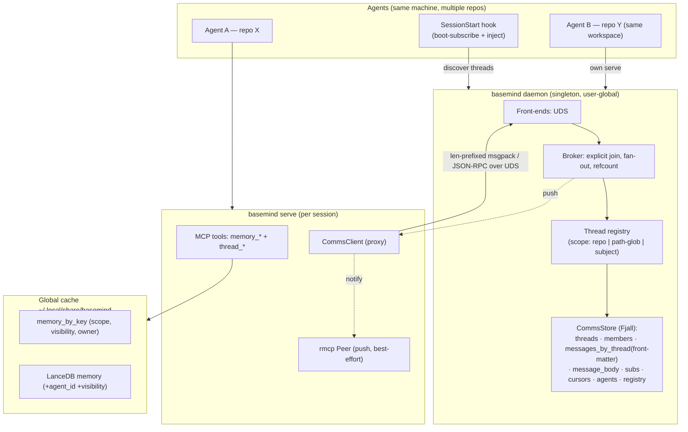

# Architecture

basemind is a single Rust crate that builds one binary (`basemind`) and exposes
its internals as a library. The binary serves three roles: `basemind scan` indexes
a workspace, `basemind serve` runs the MCP stdio server, and the daemon
(`basemind comms daemon`, auto-spawned; singleton per user) is the sole writer managing a
machine-global cache.

The Cargo workspace also vendors four crates under `crates/` — `stack-graphs`,
`tree-sitter-graph`, `tree-sitter-stack-graphs`, `lsp-positions` — a tree-sitter-0.26 fork of
the upstream stack-graphs project, maintained in-tree because upstream targets an older
tree-sitter. The fork root-caused and fixed two upstream panics and drops the C-FFI, serde,
sqlite, and visualization modules basemind doesn't use. It backs the Python/Java half of the
code-intelligence tier (see [Code intelligence](#code-intelligence-precise-resolution) below).

```text
                    ┌─────────────┐
                    │ basemind    │
                    │ scan        │
                    └─────┬───────┘
                          │
                          │ IPC (UDS)
                          ▼
        ┌──────────────────────────────────┐
        │  basemind daemon (per-user)      │
        │                                  │
        │  ┌─────────┐ ┌─────────────┐    │
        │  │ Fjall   │ │ LanceDB     │    │
        │  │ writer  │ │ writer      │    │
        │  └─────────┘ └─────────────┘    │
        │        (sole writer per machine) │
        │  ~/.local/share/basemind/       │
        └────┬────────────────────────┬───┘
             │                        │
   ┌─────────▼──────┐    ┌───────────▼────────┐
   │ Content-addr   │    │ Fjall + LanceDB    │
   │ msgpack blobs  │    │ (shared, read-only)│
   │ (deduped)      │    │                    │
   └────────────────┘    └───────────┬────────┘
                                     │
                   ┌─────────────────┴──────────────┐
                   │ (all repos/worktrees share)    │
                   ▼                                ▼
           ┌────────────────┐              ┌─────────────────┐
           │ basemind serve │              │ basemind serve  │
           │ (session 1)    │  (read-only) │ (session 2)     │
           └────────┬───────┘              └────────┬────────┘
                    │                               │
                    └───────────┬───────────────────┘
                                │ MCP stdio (rmcp)
                                ▼
                    ┌──────────────────────┐
                    │ AI coding agents     │
                    │ (Claude Code, etc.)  │
                    └──────────────────────┘
```

## Source layout

```text
src/
├── lib.rs                  — public re-exports
├── main.rs                 — CLI entry (scan, serve, watch, query, lang, …)
├── version.rs              — RELEASE_MINOR — single source of truth for schema versions
├── scanner.rs              — orchestrates the scan pipeline: extraction → Fjall index →
│                             code-map persist barrier → optional enrichment lanes
├── scanner_file.rs         — per-file pipeline (read/classify/extract) + the rayon pool
├── scanner_filter.rs       — include/exclude globs, submodule pruning, incremental
│                             IndexFilter (nested-.gitignore-aware)
├── scanner_lanes.rs        — fault containment (catch_unwind) for the lanes that run after
│                             the code-map persist barrier
├── scanner_code.rs         — code-search branch: L1/L2 → code chunks (feature code-search)
├── scanner_docs.rs         — document-tier scan (PDF/Office/HTML → LanceDB, feature documents)
├── backpressure.rs         — FootprintGate: best-effort memory admission control
├── sysres.rs               — process RSS / physical-footprint (macOS) sampling
├── chunk.rs                — code-chunk model + chunker (feature code-search)
├── embeddings.rs           — shared ONNX embedding engine (feature intelligence)
├── url.rs                  — boundary-validated Url newtype (feature crawl)
├── store.rs                — content-addressed msgpack blob store; Store facade; holds IndexDb
├── store_blob.rs           — blob (de)framing + atomic write
├── store_layout.rs         — cache root / workspace-dir mapping; workspace.json marker
├── store_lock.rs           — .basemind/.lock flock + holder metadata + writer probe
├── store_gc.rs             — cache garbage collection
├── store_gc_workspace.rs   — orphaned-workspace reaper for the machine-global cache
├── store_cache_admin.rs    — cache clear / stats admin surface (CLI + MCP)
├── index/
│   ├── mod.rs              — Fjall-backed secondary index; INDEX_SCHEMA_VER; refs_by_def /
│   │                         refs_by_path (code-intelligence reverse index)
│   ├── keys.rs             — length-prefixed composite key encodings
│   └── writer.rs           — atomic read-before-write upsert; per-file commit;
│                             upsert_cross_file_edge
├── extract/                — tree-sitter extraction tiers
│   ├── l1.rs               — outlines (symbols, signatures, imports, docs)
│   ├── l2.rs               — call sites (callee, byte offset, line/col)
│   ├── l3.rs               — structural hash of symbol bodies
│   ├── locals.rs           — tree-sitter `locals`-query intra-file scope resolution
│   │                         (the grammar-native fallback for the code-intel tier)
│   └── doc.rs              — xberg integration; FileMapDoc (+ keywords,
│                             entities, summary on the documents path)
├── intel/                  — code-intelligence tier: scope/import-resolved navigation
│   │                         (see "Code intelligence" below)
│   ├── mod.rs              — engine dispatch + feature gates
│   ├── model.rs            — FileResolvedRefs / ResolvedEdge / ImportEdge / ExportEdge
│   ├── resolve.rs          — per-file dispatch: oxc → stack-graphs → locals fallback
│   ├── resolve_pass.rs     — post-scan pass: caching, index staging, cross-file trigger
│   ├── resolver.rs         — per-language SpecifierResolver (JS/TS, Python, Java)
│   ├── xfile.rs            — cross-file stitch (importer binding → export site)
│   ├── js.rs               — JS/TS via oxc (feature code-intel-js)
│   ├── stackgraph.rs       — Python/Java via vendored .tsg stack-graphs
│   │                         (feature code-intel-stack)
│   └── tsg/{python,java}.tsg — vendored stack-graph name-binding rulesets
├── git_history/            — precomputed git-history index (.basemind/git-history.fjall/,
│   │                         see "Git-history index" below)
│   ├── mod.rs              — GitHistoryIndex; Local/Remote backend; CommitMeta; partitions
│   ├── builder.rs          — sync: walk HEAD, populate partitions incrementally
│   ├── reader.rs           — indexed-vs-live query surface for the history MCP tools
│   ├── fts.rs              — full-text search over commit messages
│   ├── keys.rs, encoding.rs — key layout + delta-varint posting-list encoding
│   ├── proto.rs            — daemon RPC request/response shapes
│   └── remote.rs           — daemon-forwarding backend (feature comms)
├── config/                 — schema-driven config (TOML/CLI/MCP/env)
│   ├── v1.rs               — top-level ConfigV1, LlmConfig, CodeIntelConfig (schemars-derived)
│   ├── resources.rs        — [resources]: scan_threads, embed_threads, max_footprint_mb,
│   │                         document_models (see "Resource governance" below)
│   ├── documents.rs        — DocumentsConfig + sub-configs, ApiKey, SecretString
│   ├── code.rs             — [code_search] config table
│   ├── shells.rs           — [shells] config table
│   ├── comms.rs            — [comms] config table (broker daemon + identity)
│   ├── overrides.rs        — DocumentsCliOverrides — backs clap and MCP flatten
│   ├── layered.rs          — merge_layers (Mcp > Cli > Env > File > Default)
│   └── source.rs           — ConfigSource + ProvenanceMap ledger
├── mcp/                    — MCP server
│   ├── mod.rs, state.rs    — server bootstrap; shared ServerState
│   ├── tools.rs            — #[tool] methods (thin wrappers; 1000-line cap)
│   ├── tools_<area>.rs     — area-sliced tool shims: admin, archmap, code, comms,
│   │                         compress, git, governance, memory, registry, shells, web
│   ├── helpers.rs          — tool bodies; shared scan / decode helpers
│   ├── helpers_<area>.rs   — area-sliced helper bodies: admin, archmap, calls,
│   │                         calls_scan, code, comms, compress, documents, files, git,
│   │                         governance, graph, grep, impls, intel (goto_definition body),
│   │                         proposals, registry, shells, telemetry, web
│   ├── memory.rs           — search_documents + memory_* (LanceDB-backed)
│   ├── types.rs, types_<area>.rs — JsonSchema-derived request / response structs,
│   │                         mirroring the tools_/helpers_ area split
│   ├── cursor.rs           — cursor encoding for paginated tools
│   ├── savings.rs          — token-savings heuristics for telemetry
│   ├── telemetry.rs        — per-call telemetry.jsonl writer
│   └── budget.rs, toon.rs, lean.rs, lenient.rs, kneedle.rs, notifications.rs,
│       completions.rs, prompts.rs, tokens.rs, background.rs, daemon_forward.rs,
│       map_fingerprint.rs, identity.rs — response budgeting, TOON/lean output
│       shaping, request leniency, daemon-forward plumbing for Seam B
├── comms/                  — agent-comms daemon: broker, thread registry, memory,
│                             worktree registry (see "Agent comms" below)
├── git/, git_cache.rs      — gix-backed history, blame, diff, status (git/mod.rs,
│                             commit.rs, remote.rs, worktree.rs); git_cache.rs is the
│                             blame/log/diff disk + in-process LRU cache
├── query.rs                — read-side helpers shared by MCP tools + CLI
├── path.rs                 — RelPath: byte-precise repo-relative paths
├── lang.rs                 — LangId = &'static str (TSLP pack name), parser pool,
│                             query cache, override-then-TSLP-fallback try_get_query
├── lance/                  — LanceDB schema + open/write helpers (feature intelligence)
├── search/                 — BM25 / exact / RRF keyword search over code chunks
│                             (feature code-search)
├── shells/                 — agent-spawned shell sessions (attach/daemon/launcher,
│                             feature shells)
├── textcompress/           — delta-aware text-edit compression for large file writes
├── web/                    — web crawl ingestion (feature crawl)
├── registry/                — daemon-side worktree/branch claim registry
├── cli/                     — CLI subcommand implementations, one file per area
│                             (admin, codemap, comms, git, governance, memory, shells, web, …)
├── queries/<pack-name>.scm — hand-written extraction queries (override TSLP tags.scm)
├── render.rs, hashing.rs, watcher.rs                   — supporting modules

crates/                    — vendored tree-sitter-0.26 stack-graphs fork (workspace members):
                             stack-graphs, tree-sitter-graph, tree-sitter-stack-graphs,
                             lsp-positions
```

## Scan pipeline

```text
Walker (gitignore-aware)
  → filter by user glob + size cap
  → rayon par_iter
    → process_file(rel, contents):
        lang::detect()                — TSLP extension → LangId (or skip)
        L1 outline   (always)         — extract::l1
        L2 calls     (eager if cfg)   — extract::l2
        Store::write_l1               — content-addressed msgpack blob
        Store::write_l2 (if eager)
  → collect FileResult { rel, l1_hash, l2_hash?, … }
  → Forward to daemon via IPC (UDS)
        IndexWriter::upsert_file(...) — Fjall secondary index
        per-file commit               — atomic batch (daemon-side)
  → apply_outcomes:
        write Index meta
        prune deleted files via IndexWriter::remove_file
  → flush_code_map: Store::flush → index.msgpack        ═══ DURABILITY BARRIER ═══
  → optional enrichment lanes (each run_optional_lane-wrapped, catch_unwind-contained):
        LANE_RESOLVE        — intel::resolve_pass (intra + cross-file resolution)
        LANE_DOC_BATCHES    — document chunks → LanceDB (feature documents)
        LANE_CODE_BATCHES   — code chunks → LanceDB (feature code-search)
        LANE_CODE_REMOVALS  — purge code_chunks rows for removed files
        LANE_DOC_REMOVALS   — purge documents rows for removed files
        LANE_BM25_STATS     — recompute corpus-global BM25 N / avgdl
```

The daemon is the sole writer to Fjall and LanceDB. Scan processes forward their extraction
results to the daemon, which applies index updates atomically.

Key invariants:

- **Per-file commit** — every `process_file` commits its Fjall batch before
  returning. Fjall handles cross-thread locking; the scanner does not.
- **Atomic upsert** — `IndexWriter::upsert_file` is read-before-write: read
  existing primary entries first to derive secondary-index keys for deletion,
  then stage all deletes + inserts in one batch. No torn state on re-scan.
- **Code-map persist barrier** — `Store::flush` (writing `index.msgpack`) runs
  immediately after extraction and the Fjall writes are done, BEFORE any optional
  lane. Everything after the barrier — resolved-reference stitching, LanceDB
  document/code embedding batches, BM25 corpus stats — is enrichment: each lane
  runs inside `scanner_lanes::run_optional_lane` (`catch_unwind`-wrapped), so a
  panic or hang in one lane degrades only that lane (e.g. "no resolved refs")
  and never costs the code map itself. Source: `src/scanner_lanes.rs`.
- **Eager L2 cost** — scanning TypeScript at ~81 k files takes ~22 s with
  eager L2 on (the default). The `scan.eager_l2 = false` escape hatch trades
  reference search for fastest scan.
- **`scan_paths` removal mirror** — when a file disappears between scans,
  `scan_paths` calls `IndexWriter::remove_file` so secondary indexes don't leak
  stale entries.

## Code intelligence (precise resolution)

basemind's default navigation (`find_references` / `find_callers`) is a name-based scan over
the tree-sitter code map: fast and complete, but it can't tell a shadowed local from an import
or a same-named symbol in another scope. The `intel` tier (`src/intel/`) adds a second,
precision layer: per-ecosystem engines that run their own parser, resolve scope and imports
properly, and produce resolved reference/definition edges the scanner's post-scan pass
persists into the Fjall `refs_by_def` reverse index.

### Two engines

| Ecosystem | Engine | Feature | Coverage |
|---|---|---|---|
| JavaScript / TypeScript | oxc (`oxc_semantic` + `oxc_resolver`) | `code-intel-js` | Full scope + import/export resolution, intra- and cross-file. Self-contained — no tree-sitter grammar needed. |
| Python, Java | vendored `.tsg` stack-graphs (`crates/stack-graphs`) | `code-intel-stack` | `.tsg` name-binding rules executed against the tree-sitter parse tree, per file, for intra-file resolution; cross-file resolution runs through the shared `SpecifierResolver` join (functions/classes/imports for both languages). Java qualified member calls are a known gap (see below). |
| Every other language | tree-sitter `locals` query (`src/extract/locals.rs`) | none (always on) | Intra-file lexical scope binding only — the grammar-native fallback, no import resolution. |

`[code_intel] precise_resolution` (default `true`) is the master switch: when `false`, the
oxc/stack-graphs engines are skipped and every language falls back to `locals`.

### Intra-file vs. cross-file

- **Intra-file resolution** links a use to its definition within the same file (a `ResolvedEdge`:
  `use_start..use_end` → `def_start..def_end`, byte spans). Computed per file by
  `intel::resolve::resolve_file` and cached in a content-addressed `<hash>.rref.msgpack` blob
  (`intel::model::FileResolvedRefs`) alongside the L1/L2 blobs — a file whose bytes are
  unchanged skips re-analysis on the next scan.
- **Cross-file resolution** links an importer's local binding to the definition it actually
  refers to in another file. `intel::xfile::stitch_cross_file_edges` runs once per scan: for
  each importer, it resolves the module specifier via a per-language
  `intel::resolver::SpecifierResolver` (JS/TS: Node/tsconfig resolution via `oxc_resolver`,
  including monorepo path aliases; Python: dotted/relative import path arithmetic over `src/`
  and flat layouts; Java: fully-qualified-name resolution over Maven/Gradle source roots), then
  joins the imported name against the target file's export list — following re-export chains
  (package `__init__.py`, TS barrels) up to 8 hops. The result is written straight to
  `refs_by_def` / `refs_by_path`; nothing cross-file is cached in the per-file blob, so an
  unchanged file whose *dependency* moved still gets re-stitched correctly.
- `intel::resolve_pass` has two entry points sharing this compute/stage machinery: `resolve_pass`
  (wholesale, after a full `scan`) and `resolve_pass_incremental` (the watcher path — restages
  only the changed files' intra facts and re-stitches only the affected importer set: the
  changed files plus every file that imports one).

### The honest contract: name scan is the floor, resolution only annotates

`find_callers` never narrows to "only the resolved subset" — it reports every call site
`find_references` would (the same name-based, no-scope scan), so the two agree on `total` for an
unambiguous name; that set is the answer to "what calls this?" and is complete unless truncated.
Resolution *annotates* each hit with `resolved: Option<bool>` (`true` = proven to bind to this
definition) and reports `resolved_total` on the response — `find_references` itself carries no
`resolved` annotation, since it never resolves a definition to check against. `resolved: false`
is not evidence a hit isn't a real caller — resolution can't see through a module-object import
(`from pkg import mod` then `mod.f()`) or an unresolvable path alias — so a caller wanting
completeness should trust `total`, not `resolved_total`; a caller wanting precision filters on
`resolved`. `goto_definition`
(`src/mcp/helpers_intel.rs`) is the direct read surface over this tier: it resolves a
`path:line:column` position to its definition, following one cross-file hop when the in-file
binding is an import, and returns no `definition` (not an error) when the position holds no
resolved binding.

### Known limitation

Java cross-file member-call resolution (`Foo.greet()`, where `Foo` is imported) is not yet
resolved to the imported class's method — only same-file, non-conflated intra resolution is
covered today (see the `java_imported_class_not_conflated_with_local_method` test in
`src/intel/stackgraph.rs`). Java static imports (`import static a.b.C.method;`) are also not
distinguished from type imports and so never cross-file-resolve (`src/intel/resolver.rs`).
Both are misses, never wrong answers — the name-based scan still finds these call sites.

## Inverted index

A Fjall LSM keyspace at `~/.local/share/basemind/views/<workspace_hash>/<view>/index.fjall/`.
Daemon-managed; all serving sessions read concurrently from a read-only handle. Source:
`src/index/{mod,keys,writer}.rs`.

| Keyspace | Purpose |
|---|---|
| `meta` | Constants (e.g. `schema_ver`). |
| `symbols_by_path` | Per-file outline lookups. |
| `symbols_by_name` | `name`-prefix range scans for symbol search. |
| `calls_by_path` | Per-file call lookups. |
| `calls_by_callee` | `callee`-prefix range scans — drives `find_references`. |
| `imports_by_module` | `module`-prefix range scans — drives `dependents`. |
| `imports_by_path` | Per-file import lookups. |
| `implementations_by_trait` | `trait`-prefix range scans — drives `find_implementations`. |
| `implementations_by_path` | Per-file implementation lookups. |
| `refs_by_def` | Scope/import-resolved reference edges keyed by defining site — backs the `resolved` annotation on `find_callers` and the cross-file hop in `goto_definition`. |
| `refs_by_path` | `refs_by_def` companion keyed by the USE file — O(prefix) delete on re-resolve. |
| `embeddings` | Reserved for in-Fjall vector index; LanceDB owns the live vectors. |
| `memory_by_key` | Agent memory (`memory_put` / `memory_get`); LanceDB owns the embeddings. |

Key shapes (length-prefixed, see `src/index/keys.rs`):

```text
symbols_by_path     u16:len(rel) ‖ rel ‖ start_byte:u32_be
symbols_by_name     u16:len(name) ‖ name ‖ kind:u8 ‖ u16:len(rel) ‖ rel ‖ start_byte:u32_be
calls_by_path       u16:len(rel) ‖ rel ‖ start_byte:u32_be
calls_by_callee     u16:len(callee) ‖ callee ‖ u16:len(rel) ‖ rel ‖ start_byte:u32_be
imports_by_module   u16:len(module) ‖ module ‖ u16:len(rel) ‖ rel ‖ start_byte:u32_be
refs_by_def         u16:len(def_path) ‖ def_path ‖ def_start:u32_be ‖ u16:len(use_path) ‖ use_path ‖ use_start:u32_be
refs_by_path        u16:len(use_path) ‖ use_path ‖ use_start:u32_be ‖ u16:len(def_path) ‖ def_path ‖ def_start:u32_be
```

Length-prefixed components guarantee prefix-scan isolation: a `Foo` prefix never
spills into `Foobar`. Schema version is stamped in the `meta` keyspace; mismatch
on open drops the whole `index.fjall/` directory and the next scan rebuilds it.

## Schema versioning

Two on-disk schemas, both tracking `RELEASE_MINOR` from `src/version.rs`:

- `INDEX_SCHEMA_VER` in `src/index/mod.rs` — Fjall partition / key encoding
- `SCHEMA_VER` in `src/extract/mod.rs` — msgpack blob format

Bump cadence:

- Minor release (`0.1.x` → `0.2.0`) bumps `RELEASE_MINOR` → both caches wipe
  on next scan.
- Patch release (`0.1.0` → `0.1.1`) MUST be cache-compatible — never bump from
  a patch commit.

Wipe-on-mismatch is the migration story; the next `basemind scan` rebuilds from
source.

## MCP surface

`basemind serve` exposes a stdio MCP server (`rmcp`). The live contract is
`tests/mcp_smoke.rs`.

Conventions:

- All paths are `RelPath` (byte-precise, repo-relative). No arbitrary `String`
  paths.
- Responses are `JsonSchema`-derived and stable; new fields are additive with
  `#[serde(default)]`.
- Lists are capped (`limit`, default 100, max 1000). Index scans use
  `scan_cap = limit * 8` to bound work on common names.
- Tool descriptions are the routing surface for agents; semantics (substring vs
  prefix, scope-aware vs name-only) are stated honestly.
- Tool bodies live in `src/mcp/helpers*.rs`, area-sliced (`helpers_calls.rs`,
  `helpers_documents.rs`, `helpers_graph.rs`, `helpers_grep.rs`, `helpers_impls.rs`,
  `helpers_intel.rs`, `helpers_web.rs`, and more — see [Source layout](#source-layout));
  `tools.rs` and the `tools_<area>.rs` siblings contain `#[tool]` shims only.

## Git layer

`gix`-backed log, blame, diff, and status. The git cache at `~/.local/share/basemind/git-cache/<workspace_hash>/`
has two tiers:

- An in-process LRU (1024 entries per category by default; tune via
  `basemind serve --git-cache-mem`).
- A sha-keyed disk store: `commit_files/<sha>.msgpack`,
  `log/<head_sha>__<scope>.msgpack`, `blame/<sha>__<path_hash>.msgpack`.

Commits are immutable, so once a sha-keyed entry is on disk it's valid forever.
HEAD-keyed entries (`log`) roll off naturally when HEAD moves.

Drop the disk cache with `basemind cache clear`. Disable per-run with
`basemind serve --no-git-cache-disk`.

### Git-history index

A separate, repo-level Fjall store at `.basemind/git-history.fjall/` — distinct from the
`git-cache/` blame/log tier above. It turns the history MCP tools (`commits_touching`,
`recent_changes`, `find_commits_by_path`, `hot_files`, the `symbol_history` commit walk, and
full-text `search_git_history`) from live history walks into posting-list lookups. Source:
`src/git_history/{mod,builder,reader,fts,keys,encoding,proto,remote}.rs`.

- It is repo-global (identical across the working/staged/rev views) and carries its own
  `GIT_HISTORY_SCHEMA`, independent of the code-map `INDEX_SCHEMA_VER` — a code-map schema bump
  must never throw away a 200k-commit walk.
- Fjall's directory lock is exclusive even for a read-only open, so exactly ONE process may hold
  this database. Which process that is depends on the deployment, modeled as a `Backend::Local
  | Backend::Remote` enum on `GitHistoryIndex`:
  - **Standalone** (no comms daemon): the process that opens it (`scan`, a writable `serve`, a
    one-shot CLI query) holds it locally and, if a writer, builds it in-process.
  - **Daemon-backed**: the daemon — the machine's sole fjall writer — holds and builds the
    database; every front-end (a `daemon_writer` serve, the one-shot CLI) holds a `Remote` proxy
    that forwards each history query over the socket rather than trying (and failing) to open it.
- A process that can reach neither backend falls back to the live walk (`git_history: None`). The
  index is a pure accelerator: tools use it only when `last_indexed_head == HEAD` and otherwise
  live-walk and report `partial: true`, so it can never serve stale results.
- A linked worktree shares the MAIN worktree's index (keyed on the main worktree root) rather than
  rebuilding its own, since the commit graph is identical across worktrees of one clone.

## Resource governance

The `[resources]` config table (`src/config/resources.rs`) is the single place an operator bounds
basemind's footprint on a constrained machine:

| Field | Default | Purpose |
|---|---|---|
| `scan_threads` | `0` (auto: rayon's per-core default) | Cap on the code-map scanner's rayon pool. |
| `embed_threads` | `0` (auto: `max(2, logical_cpus / 4)`) | Cap on the ONNX embedding pool. |
| `embed_batch_size` | `32` | Chunks submitted to ONNX per batch. |
| `max_concurrent_documents` | `0` (unbounded) | Reserved cap on concurrent document extraction. |
| `document_models` | `full` | Model families document extraction runs: `full` \| `code_only` (embeddings only, no keywords/NER/summarization/OCR) \| `none` (metadata + keyword search only). |
| `max_footprint_mb` | `0` (disabled) | Hard ceiling on process physical footprint (mebibytes). |

When `max_footprint_mb` is set, the best-effort `FootprintGate` backpressure
(`src/backpressure.rs`) samples the process `phys_footprint` (macOS `TASK_VM_INFO` via
`src/sysres.rs`; a no-op elsewhere) at the document-extraction and chunk-embedding admit points
and parks the calling worker in a bounded backoff loop while the process is over the ceiling. It
is deliberately never a hard invariant: an unreadable sample admits immediately, and a sustained
overshoot admits anyway after `max_wait` (5s) to guarantee forward progress — the gate shaves the
scan's peak memory, it never fails a scan.

## Hardening

`tests/harden.rs` is the real-OSS canary harness. `#[ignore]`-gated; run with:

```bash
cargo test --release --test harden -- --ignored --nocapture
```

It clones 8 upstream repos under `/tmp/basemind-harden/` (`ripgrep`, `tokio`,
`typescript`, `react`, `django`, `requests`, `gin`, plus a shallow `ripgrep`
variant), runs `basemind scan` on each, then sweeps every MCP code-map tool plus
a representative subset of git tools. Canary assertions catch regressions:

- **tokio**: `find_references("spawn")` returns ≥ 200 hits
- **django**: `find_references("get")` returns ≥ 200 hits
- **react**: `search_symbols("useState")` returns ≥ 20 hits
- **ripgrep-shallow**: `any_truncated == true` (shallow-clone signal surfaces)

Per-repo metrics land at `/tmp/basemind-harden-*.log`.

## Agent comms & split memory

The daemon owns a separate Fjall store for agent communication (singleton per user):



### Why a separate daemon

The daemon is the sole Fjall writer (across all repos on the machine). This allows N `basemind serve`
sessions on the same repo to read concurrently without downgrade-to-read-only races. The daemon is
a singleton enforced by socket-bind-as-lock (a Unix domain socket whose successful bind IS the lock);
stale sockets are reclaimed probe-before-unlink. It auto-starts on first need and stops on explicit `comms stop`.

### Thread model

Threads are registered in a central registry owned by the daemon. Each thread has explicit membership
(list of agents) and at least one of: a subject, a scope (repo remote or path-glob), or named members.
Agents join threads explicitly via `thread_join` or `thread_start`; no auto-join. Group scopes (path-glob,
repo) help agents discover relevant threads, but joining is always explicit.

### Condensed two-tier messages

A message is a front-matter envelope (`id, thread, from, ts_micros, subject, reply_to, body_len, body_sha`)
stored in `messages_by_thread`, plus a separately-stored body in `message_body` keyed by message id.
`thread_history` and `inbox_read` scan front-matter ONLY — never the body — to stay token-frugal;
the body is fetched on demand by `message_get {message_id}`. Poster supplies a required short `subject`
plus an optional long body.

### Split memory

Repo memory is namespaced by `(scope, visibility, owner)`: the `memory_by_key` Fjall key is
`(scope, vis_byte, owner, key)` and the LanceDB memory table has `agent_id` + `visibility` columns.
Group memory (`visibility=group`, default, `owner=""`) is shared across agents in a repo; individual
memory (`visibility=individual`, `owner=agent_id`) is private to one agent. Schema is guarded by
`MEMORY_SCHEMA_VER` (derives from `RELEASE_MINOR`); a mismatch wipes and rebuilds.

### Worktree registry

The daemon maintains an advisory registry of active worktrees and branches per workspace. Agents can
claim a worktree+branch via `worktree_claim` and release via `worktree_release`. Claims are advisory
(no locking); the registry helps avoid collisions and is read-only to serving sessions.
