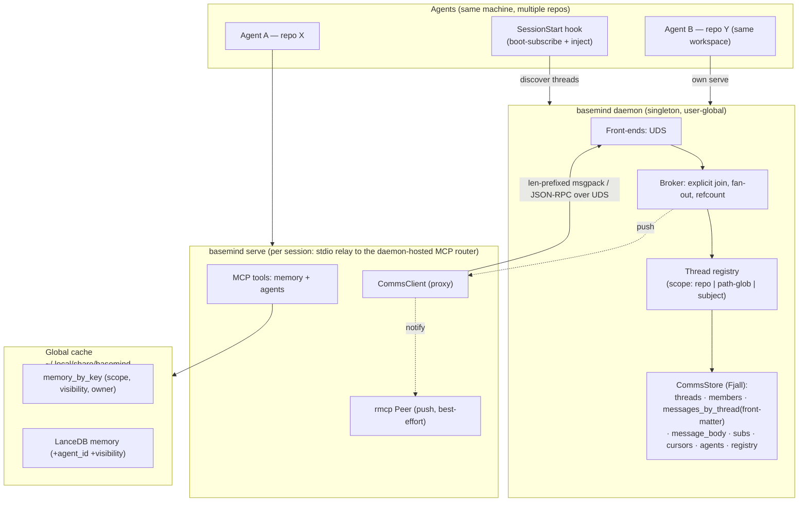

# Architecture

basemind is a single Rust crate that builds one binary (`basemind`) and exposes
its internals as a library. The binary serves three roles: `basemind scan` indexes
a workspace, the daemon (`basemind comms daemon`, auto-spawned; singleton per user) is the sole
writer managing a machine-global cache and hosts the MCP router over one shared read stack per
workspace, and `basemind serve` is a thin stdio relay that ensures the daemon and pumps bytes to it
(HTTP-native clients dial the daemon directly). `serve` needs the `comms` feature; the one-shot CLI
(`basemind code …`, `git …`) opens the store itself and does not.

The Cargo workspace also vendors four crates under `crates/` — `stack-graphs`,
`tree-sitter-graph`, `tree-sitter-stack-graphs`, `lsp-positions` — a tree-sitter-0.26 fork of
the upstream stack-graphs project, maintained in-tree because upstream targets an older
tree-sitter. The fork root-caused and fixed two upstream panics and drops the C-FFI, serde,
sqlite, and visualization modules basemind doesn't use. It backs the Python/Java half of the
code-intelligence tier (see [Code intelligence](#code-intelligence-precise-resolution) below).

> This document describes the system as-built. For *why* a given decision was made and which
> alternatives were rejected, see the Architecture Decision Records in [`adr/`](adr/README.md).

```text
                    ┌─────────────┐
                    │ basemind    │
                    │ scan        │
                    └─────┬───────┘
                          │ extraction results over IPC (UDS)
                          ▼
        ┌──────────────────────────────────────┐
        │  basemind daemon (singleton)         │
        │                                      │
        │  ┌─────────┐ ┌─────────────┐         │
        │  │ Fjall   │ │ LanceDB     │         │
        │  │ writer  │ │ writer      │         │
        │  └─────────┘ └─────────────┘         │
        │  sole writer per machine; hosts the  │
        │  MCP router + one shared read stack  │
        │  per workspace                       │
        └────┬─────────────────────────┬───────┘
             │ <cache>/cache/          │ streamable HTTP (opt-in)
             │ workspaces/<key>/       │ and the stdio relay
   ┌─────────▼──────┐                  │
   │ Content-addr   │                  │
   │ msgpack blobs  │       ┌──────────┴───────────────┐
   │ (cache/blobs,  │       │ basemind serve           │
   │ machine-wide,  │       │ (stdio relay, one per    │
   │ deduped)       │       │ client session)          │
   └────────────────┘       └──────────┬───────────────┘
                                       │ MCP stdio
                                       ▼
                            ┌──────────────────────┐
                            │ AI coding agents     │
                            │ (Claude Code, etc.)  │
                            └──────────────────────┘
```

## Source layout

```text
src/
├── lib.rs                  — public re-exports
├── main.rs                 — CLI entry (scan, serve, watch, code, lang, …)
├── version.rs              — RELEASE_MINOR — single source of truth for schema versions
├── scanner.rs              — orchestrates the scan pipeline: extraction → Fjall index →
│                             code-map persist barrier → optional enrichment lanes
├── scanner_file.rs         — per-file pipeline (read/classify/extract) + the rayon pool; routes
│                             non-code files (`lang::is_non_code`) to the document tier
├── scanner_filter.rs       — include/exclude globs, submodule pruning, incremental
│                             IndexFilter (nested-.gitignore-aware)
├── scanner_lanes.rs        — fault containment (catch_unwind) for the lanes that run after
│                             the code-map persist barrier
├── scanner_code.rs         — code-search branch: L1/L2 → code chunks (feature code-search)
├── scanner_docs.rs         — document-tier scan (PDF/Office/HTML → LanceDB, feature documents); also takes
│                             prose/data/config (md/json/yaml/toml, `lang::is_non_code`): the code map is code-only
├── scanner_doc_links.rs    — document→code link production (ADR-0008) for the document tier
├── scanner_policy.rs       — embed-policy reconciliation: vector rows follow `embed*` config changes
├── scanner_candidates.rs   — candidate enumeration + the [scan] max_candidates ceilings and
│                             the BASEMIND_ALLOW_EXTRA_ROOTS grant for extra_roots
├── scanner_index_batch.rs  — per-worker index write batch: commits on files OR staged bytes
│                             OR the process-wide staging ceiling
├── scanner_drive.rs        — ScanObserver: per-file results are streamed, never accumulated
├── chunk_drive.rs          — bounded process/absorb driver for whole-corpus passes
├── scan_evidence.rs        — scan-inflight.json breadcrumb + rss/ceiling log line: what a
│                             SIGKILLed scan leaves behind (see "Evidence" below)
├── backpressure.rs         — FootprintGate: best-effort memory admission control;
│                             DocSlot semaphore for max_concurrent_documents
├── sysres.rs               — process memory usage + platform limit (cgroup v1/v2, mach,
│                             Windows); rate-limited, backs the footprint ceiling
├── sysres_cgroup.rs        — cgroup / procfs parsers + mount-parameterised readers
├── alloc_tag.rs            — macOS: retag mimalloc's mappings (Mach VM tag 254) so the heap stops
│                             reading as IOAccelerator "GPU" memory
├── daemon_lock.rs          — single-owner daemon lock, pidfile, machine-wide live-daemon registry +
│                             ceiling (BASEMIND_MAX_DAEMONS)
├── eval/                   — `basemind admin eval`: scores retrieval quality + token savings
│                             against gold task files (see benchmarks/eval/README.md)
├── chunk.rs                — code-chunk model + chunker (feature code-search)
├── embeddings.rs           — shared ONNX embedding engine (feature intelligence)
├── url.rs                  — boundary-validated Url newtype (feature crawl)
├── store.rs                — content-addressed msgpack blob store; Store facade; holds IndexDb
├── store_blob.rs           — blob (de)framing + atomic write
├── store_layout.rs         — cache root / workspace-dir mapping; workspace.json marker
├── store_lock.rs           — workspace-cache `.lock` flock + holder metadata + writer probe
├── store_gc.rs             — tier-aware, cross-workspace reference-counted blob sweep (`cache gc`)
├── store_gc_live.rs        — liveness split by tier (code lane vs document lane) + the machine-wide
│                             `cache/gc.lock` that serialises sweeps
├── store_gc_budget.rs      — cache size budget + `gc-state.json` (last sweep health)
├── store_gc_workspace.rs   — orphaned-workspace reaper for the machine-global cache
├── store_seed.rs           — seed a new linked worktree's view from a sibling checkout (reflink)
├── store_cache_admin.rs    — cache clear / stats admin surface (CLI + MCP)
├── index/
│   ├── mod.rs              — Fjall-backed secondary index; INDEX_SCHEMA_VER; refs_by_def /
│   │                         refs_by_path (code-intelligence reverse index)
│   ├── keys.rs             — length-prefixed composite key encodings
│   ├── grep_bloom.rs       — per-file trigram bloom rows: the `code grep` candidate prefilter
│   │                         (ADR-0012)
│   ├── name_dict.rs        — resident dictionary of distinct callee / trait names behind
│   │                         `references` / `callers` / `implementations`
│   └── writer.rs           — atomic read-before-write upsert; per-file commit;
│                             upsert_cross_file_edge
├── extract/                — tree-sitter extraction tiers
│   ├── l1.rs               — outlines (symbols, signatures, imports, docs)
│   ├── l2.rs               — call sites (callee, byte offset, line/col)
│   ├── l3.rs               — structural hash of symbol bodies
│   ├── locals.rs           — tree-sitter `locals`-query intra-file scope resolution
│   │                         (the grammar-native fallback for the code-intel tier)
│   ├── doc.rs              — xberg integration; FileMapDoc (+ keywords,
│   │                         entities, summary on the documents path)
│   └── doc_cost.rs         — header-derived peak-memory estimate of one document (skip if it
│                             alone exceeds the footprint ceiling)
├── intel/                  — code-intelligence tier: scope/import-resolved navigation
│   │                         (see "Code intelligence" below)
│   ├── mod.rs              — engine dispatch + feature gates
│   ├── model.rs            — FileResolvedRefs / ResolvedEdge / ImportEdge / ExportEdge
│   ├── resolve.rs          — per-file dispatch: oxc → stack-graphs → locals fallback
│   ├── resolve_pass.rs     — post-scan pass: caching, index staging, cross-file trigger
│   ├── resolver.rs         — per-language SpecifierResolver (JS/TS, Python, Java)
│   ├── xfile.rs            — cross-file stitch (importer binding → export site)
│   ├── js.rs               — JS/TS via oxc (feature code-intel-js)
│   ├── stackgraph.rs       — Python/Java via vendored .tsg stack-graphs
│   │                         (feature code-intel-stack)
│   └── tsg/{python,java}.tsg — vendored stack-graph name-binding rulesets
├── git_history/            — precomputed git-history index (`git-history.fjall/` in the workspace cache,
│   │                         see "Git-history index" below)
│   ├── mod.rs              — GitHistoryIndex; Local/Remote backend; CommitMeta; partitions
│   ├── builder.rs          — sync: walk HEAD, populate partitions incrementally
│   ├── reader.rs           — indexed-vs-live query surface for the history MCP tools
│   ├── fts.rs              — full-text search over commit messages
│   ├── keys.rs, encoding.rs — key layout + delta-varint posting-list encoding
│   ├── proto.rs            — daemon RPC request/response shapes
│   └── remote.rs           — daemon-forwarding backend (feature comms)
├── config/                 — schema-driven config (TOML/CLI/MCP/env)
│   ├── v1.rs               — top-level ConfigV1, LlmConfig, CodeIntelConfig (schemars-derived)
│   ├── resources.rs        — [resources]: scan_threads, embed_threads, max_footprint_mb, max_map_cache_mb
│   │                         (MaxFootprint: integer | "auto" | "off"), document_models
│   │                         (see "Resource governance" below)
│   ├── root_guard.rs       — workspace-root allow-list: RootRefusal, the resolved-path
│   │                         verdict, BASEMIND_ALLOW_ANY_ROOT, root-admission.json
│   ├── documents.rs        — DocumentsConfig + sub-configs, ApiKey, SecretString
│   ├── code.rs             — [code_search] config table
│   ├── shells.rs           — [shells] config table
│   ├── comms.rs            — [comms] config table (broker daemon + identity)
│   ├── overrides.rs        — DocumentsCliOverrides — backs the clap flags
│   ├── layered.rs          — merge_layers (Mcp > Cli > Env > File > Default)
│   └── source.rs           — ConfigSource + ProvenanceMap ledger
├── mcp/                    — MCP server: nine domain tools (code, graph, git, memory, web,
│                             agents, workspace, shell, admin), each one #[tool] dispatching
│                             on a required `mode` — see "MCP surface" below
│   ├── mod.rs, state.rs    — server bootstrap; shared ServerState
│   ├── mode.rs             — define_mode!: the mode enums, wire spellings, telemetry_key(),
│   │                         and domain_modes() (what tests/cli_parity.rs walks)
│   ├── tools.rs            — the `code` tool shim (#[tool], thin wrapper; 1000-line cap)
│   ├── tools_<area>.rs     — one shim per remaining domain: admin, comms (→ `agents`),
│   │                         git, graph, memory, registry (→ `workspace`), shells
│   │                         (→ `shell`), web — filenames predate the tool/CLI rename
│   ├── term_index.rs       — resident term index (symbol names + import strings) behind the
│   │                         `symbols` / `dependents` substring sweeps
│   ├── index_route.rs      — where a references/callers/implementations read runs: local index,
│   │                         daemon-hosted (in-process), forwarded to the daemon, or in-RAM fallback
│   ├── index_read.rs       — daemon-side executor for the forwarded index reads (`IndexRead`)
│   ├── l1_cache.rs         — byte-budgeted read-through cache of decoded outlines (max_map_cache_mb)
│   ├── helpers.rs          — tool bodies; shared scan / decode helpers
│   ├── helpers_<area>.rs   — the run_<mode> dispatch bodies, area-sliced: admin, archmap,
│   │                         calls, calls_scan, code, code_search (feature code-search),
│   │                         comms, community, compress, documents, files, fingerprint,
│   │                         git, git_file, governance (feature memory), graph, graphview,
│   │                         grep, impls, intel (definition mode body), memory, proposals
│   │                         (feature memory), registry, shells, telemetry, traverse, web
│   ├── memory.rs           — search_documents + memory_* bodies behind the `memory` domain
│   ├── types.rs, types_<area>.rs — one flat <Domain>Params per domain (optional sibling
│   │                         fields per mode) + response structs, mirroring the
│   │                         tools_/helpers_ area split
│   ├── cursor.rs           — cursor encoding for paginated tools
│   ├── savings.rs          — token-savings heuristics, keyed by the domain:mode telemetry_key()
│   │                         plus the bare pre-consolidation tool-name spellings
│   ├── telemetry.rs        — per-call telemetry.jsonl writer
│   └── budget.rs, toon.rs, lean.rs, lenient.rs, kneedle.rs, notifications.rs,
│       completions.rs, prompts.rs, tokens.rs, background.rs, daemon_forward.rs,
│       map_fingerprint.rs, identity.rs — response budgeting, TOON/lean output
│       shaping, request leniency, daemon-forward plumbing for Seam B
├── stdio_relay.rs          — protocol-aware stdio relay behind `basemind serve`; survives a
│                             daemon replacement without closing the host's pipes
├── comms/                  — agent-comms daemon: broker, thread registry, memory,
│                             worktree registry (see "Agent comms" below); workspace_pool.rs is
│                             the daemon's hot-workspace + warm-read-stack pool, index_read_proto.rs
│                             the wire types of the forwarded index reads;
│                             http_auth.rs is the BASEMIND_ALLOW_HTTP opt-in + the bearer
│                             token every HTTP front-end request must present
├── git/, git_cache.rs      — gix-backed history, blame, diff, status (git/mod.rs,
│                             commit.rs, remote.rs, worktree.rs); git_cache.rs is the
│                             blame/log/diff disk + in-process LRU cache
├── query.rs                — read-side helpers shared by MCP tools + CLI
├── path.rs                 — RelPath: byte-precise repo-relative paths
├── lang.rs                 — LangId = &'static str (TSLP pack name), parser pool,
│                             query cache, override-then-TSLP-fallback try_get_query;
│                             is_non_code(): the grammars routed to the document tier
├── lance/                  — LanceDB schema + open/write helpers (feature intelligence)
├── search/                 — BM25 / exact / RRF keyword search over code chunks
│                             (feature code-search)
├── shells/                 — agent-spawned shell sessions (attach/daemon/launcher,
│                             feature shells)
├── textcompress/           — delta-aware text-edit compression for large file writes
├── web/                    — web crawl ingestion (feature crawl)
├── registry/                — daemon-side worktree/branch claim registry
├── cli/                     — CLI subcommand groups, 1:1 with the nine MCP domains: admin,
│                             agents (daemon-agent verbs), code, git, graph, memory (absorbs
│                             the old governance mine/proposals/accept/reject/audit),
│                             registry (the `workspace` group), shell, web;
│                             comms_daemon.rs is `basemind comms` — daemon lifecycle only
│                             (daemon/start/stop/status/doctor)
├── queries/<pack-name>.scm — hand-written extraction queries (override TSLP tags.scm)
├── render.rs, hashing.rs, watcher.rs                   — supporting modules

crates/                    — vendored tree-sitter-0.26 stack-graphs fork (workspace members):
                             stack-graphs, tree-sitter-graph, tree-sitter-stack-graphs,
                             lsp-positions
```

## Scan pipeline

```text
Walker (gitignore-aware)
  → filter by user glob + size cap
  → rayon par_iter
    → process_file(rel, contents):
        lang::detect()                — TSLP extension → LangId; prose/data/config grammars
                                        (lang::is_non_code) and unrecognised files go to the
                                        document tier (scanner_docs), not the code map
        L1 outline   (always)         — extract::l1
        L2 calls     (eager if cfg)   — extract::l2
        Store::write_l1               — content-addressed msgpack blob
        Store::write_l2 (if eager)
        grep bloom row (working tree) — built from the bytes already in hand
  → collect FileResult { rel, l1_hash, l2_hash?, … }
  → Forward to daemon via IPC (UDS)
        IndexWriter::upsert_file(...) — Fjall secondary index
        per-file commit               — atomic batch (daemon-side)
  → apply_outcomes:
        write Index meta
        prune deleted files via IndexWriter::remove_file
  → flush_code_map: Store::flush → index.msgpack        ═══ DURABILITY BARRIER ═══
  → optional enrichment lanes (each run_optional_lane-wrapped, catch_unwind-contained):
        LANE_RESOLVE        — intel::resolve_pass (intra + cross-file resolution)
        LANE_DOC_BATCHES    — document chunks → LanceDB (feature documents)
        LANE_CODE_BATCHES   — code chunks → LanceDB (feature code-search)
        LANE_CODE_REMOVALS  — purge code_chunks rows for removed files
        LANE_DOC_REMOVALS   — purge documents rows for removed files
        LANE_BM25_STATS     — recompute corpus-global BM25 N / avgdl
```

The daemon is the sole writer to Fjall and LanceDB. Scan processes forward their extraction
results to the daemon, which applies index updates atomically.

Key invariants:

- **Per-file commit** — every `process_file` commits its Fjall batch before
  returning. Fjall handles cross-thread locking; the scanner does not.
- **Atomic upsert** — `IndexWriter::upsert_file` is read-before-write: read
  existing primary entries first to derive secondary-index keys for deletion,
  then stage all deletes + inserts in one batch. No torn state on re-scan.
- **Code-map persist barrier** — `Store::flush` (writing `index.msgpack`) runs
  immediately after extraction and the Fjall writes are done, BEFORE any optional
  lane. Everything after the barrier — resolved-reference stitching, LanceDB
  document/code embedding batches, BM25 corpus stats — is enrichment: each lane
  runs inside `scanner_lanes::run_optional_lane` (`catch_unwind`-wrapped), so a
  panic or hang in one lane degrades only that lane (e.g. "no resolved refs")
  and never costs the code map itself. Source: `src/scanner_lanes.rs`.
- **Code-only code map** — `symbols`, `outline`, `grep` and the reference tools see code only.
  Markdown, rst, asciidoc, vimdoc, csv, json, yaml, toml, ini, xml, properties, dotenv, diff,
  gitignore/gitattributes and fluent files are chunked and searched as documents (gated by
  `[documents] include` / `exclude` and the MIME allowlist). A path that changes tier is moved on the
  next full or incremental scan: the stale code-map rows are purged, and the stale blobs are reclaimed
  by the tier-aware sweep (see [Blob store and GC](#blob-store-and-gc)). A build without the
  `documents` feature keeps the grammars, since there is no other tier for those files to go to.
- **Bounded scan** — per-file results are streamed to the index in chunks (`scanner_drive.rs`), never
  accumulated; the footprint gate pauses the drive between chunks and shrinks it when it cannot
  hold the ceiling (see [Resource governance](#resource-governance)).
- **Eager L2 cost** — scanning TypeScript at ~81 k files takes ~22 s with
  eager L2 on (the default). The `scan.eager_l2 = false` escape hatch trades
  reference search for fastest scan.
- **`scan_paths` removal mirror** — when a file disappears between scans,
  `scan_paths` calls `IndexWriter::remove_file` so secondary indexes don't leak
  stale entries.

## Code intelligence (precise resolution)

basemind's default navigation (`code` modes `references` / `callers`) is a name-based scan over
the tree-sitter code map: fast and complete, but it can't tell a shadowed local from an import
or a same-named symbol in another scope. The `intel` tier (`src/intel/`) adds a second,
precision layer: per-ecosystem engines that run their own parser, resolve scope and imports
properly, and produce resolved reference/definition edges the scanner's post-scan pass
persists into the Fjall `refs_by_def` reverse index.

### Two engines

| Ecosystem | Engine | Feature | Coverage |
|---|---|---|---|
| JavaScript / TypeScript | oxc (`oxc_semantic` + `oxc_resolver`) | `code-intel-js` | Full scope + import/export resolution, intra- and cross-file. Self-contained — no tree-sitter grammar needed. |
| Python, Java | vendored `.tsg` stack-graphs (`crates/stack-graphs`) | `code-intel-stack` | `.tsg` name-binding rules executed against the tree-sitter parse tree, per file, for intra-file resolution; cross-file resolution runs through the shared `SpecifierResolver` join (functions/classes/imports for both languages). Java qualified member calls are a known gap (see below). |
| Every other language | tree-sitter `locals` query (`src/extract/locals.rs`) | none (always on) | Intra-file lexical scope binding only — the grammar-native fallback, no import resolution. |

`[code_intel] precise_resolution` (default `true`) is the master switch: when `false`, the
oxc/stack-graphs engines are skipped and every language falls back to `locals`.

### Intra-file vs. cross-file

- **Intra-file resolution** links a use to its definition within the same file (a `ResolvedEdge`:
  `use_start..use_end` → `def_start..def_end`, byte spans). Computed per file by
  `intel::resolve::resolve_file` and cached in a content-addressed `<hash>.rref.msgpack` blob
  (`intel::model::FileResolvedRefs`) alongside the L1/L2 blobs — a file whose bytes are
  unchanged skips re-analysis on the next scan.
- **Cross-file resolution** links an importer's local binding to the definition it actually
  refers to in another file. `intel::xfile::stitch_cross_file_edges` runs once per scan: for
  each importer, it resolves the module specifier via a per-language
  `intel::resolver::SpecifierResolver` (JS/TS: Node/tsconfig resolution via `oxc_resolver`,
  including monorepo path aliases; Python: dotted/relative import path arithmetic over `src/`
  and flat layouts; Java: fully-qualified-name resolution over Maven/Gradle source roots), then
  joins the imported name against the target file's export list — following re-export chains
  (package `__init__.py`, TS barrels) up to 8 hops. The result is written straight to
  `refs_by_def` / `refs_by_path`; nothing cross-file is cached in the per-file blob, so an
  unchanged file whose *dependency* moved still gets re-stitched correctly.
- `intel::resolve_pass` has two entry points sharing this compute/stage machinery: `resolve_pass`
  (wholesale, after a full `scan`) and `resolve_pass_incremental` (the watcher path — restages
  only the changed files' intra facts and re-stitches only the affected importer set: the
  changed files plus every file that imports one).

### The honest contract: name scan is the floor, resolution only annotates

`code` mode `callers` never narrows to "only the resolved subset" — it reports every call site
mode `references` would (the same name-based, no-scope scan), so the two agree on `total` for an
unambiguous name; that set is the answer to "what calls this?" and is complete unless truncated.
Resolution *annotates* each hit with `resolved: Option<bool>` (`true` = proven to bind to this
definition) and reports `resolved_total` on the response — mode `references` itself carries no
`resolved` annotation, since it never resolves a definition to check against. `resolved: false`
is not evidence a hit isn't a real caller — resolution can't see through a module-object import
(`from pkg import mod` then `mod.f()`) or an unresolvable path alias — so a caller wanting
completeness should trust `total`, not `resolved_total`; a caller wanting precision filters on
`resolved`. `code` mode `definition`
(`src/mcp/helpers_intel.rs`) is the direct read surface over this tier: it resolves a
`path:line:column` position to its definition, following one cross-file hop when the in-file
binding is an import, and returns no `definition` (not an error) when the position holds no
resolved binding.

### Known limitation

Java cross-file member-call resolution (`Foo.greet()`, where `Foo` is imported) is not yet
resolved to the imported class's method — only same-file, non-conflated intra resolution is
covered today (see the `java_imported_class_not_conflated_with_local_method` test in
`src/intel/stackgraph.rs`). Java static imports (`import static a.b.C.method;`) are also not
distinguished from type imports and so never cross-file-resolve (`src/intel/resolver.rs`).
Both are misses, never wrong answers — the name-based scan still finds these call sites.

## Inverted index

A Fjall LSM database at `<cache>/cache/workspaces/<workspace_key>/views/<view>/index.fjall/`
(`<cache>` is `BASEMIND_DATA_HOME`, default `~/.local/share/basemind` on Linux). Fjall admits one
process per directory, so the daemon holds it and sessions reach it through the daemon (see
[Index reads](#index-reads-and-resident-lookup-structures)). Source: `src/index/{mod,keys,writer}.rs`.

| Keyspace | Purpose |
|---|---|
| `meta` | Constants (e.g. `schema_ver`). |
| `symbols_by_path` | Per-file outline lookups. |
| `symbols_by_name` | `name`-prefix range scans for symbol search. |
| `calls_by_path` | Per-file call lookups. |
| `calls_by_callee` | `callee`-prefix range scans — drives `code` mode `references`. |
| `imports_by_module` | `module`-prefix range scans — drives `code` mode `dependents`. |
| `imports_by_path` | Per-file import lookups. |
| `implementations_by_trait` | `trait`-prefix range scans — drives `code` mode `implementations`. |
| `implementations_by_path` | Per-file implementation lookups. |
| `refs_by_def` | Scope/import-resolved reference edges keyed by defining site — backs the `resolved` annotation on `code` mode `callers` and the cross-file hop in mode `definition`. |
| `refs_by_path` | `refs_by_def` companion keyed by the USE file — O(prefix) delete on re-resolve. |
| `code_bm25_postings` | Code-search BM25 keyword postings (feature `code-search`). |
| `code_bm25_by_path` | Per-file companion of `code_bm25_postings` — O(prefix) delete on re-index. |
| `grep_bloom` | One trigram bloom filter per indexed file, keyed by path, with the `(size, mtime_ns)` it was built under; the `code grep` prefilter ([ADR-0012](adr/0012-grep-content-prefilter.md)). |
| `embeddings` | Reserved for in-Fjall vector index; LanceDB owns the live vectors. |
| `memory_by_key` | Agent memory (`memory` modes `put` / `get`); LanceDB owns the embeddings. |
| `memory_archive`, `proposals` | Archived memory entries and mined co-change proposals (governance tier). |

Key shapes (length-prefixed, see `src/index/keys.rs`):

```text
symbols_by_path     u16:len(rel) ‖ rel ‖ start_byte:u32_be
symbols_by_name     u16:len(name) ‖ name ‖ kind:u8 ‖ u16:len(rel) ‖ rel ‖ start_byte:u32_be
calls_by_path       u16:len(rel) ‖ rel ‖ start_byte:u32_be
calls_by_callee     u16:len(callee) ‖ callee ‖ u16:len(rel) ‖ rel ‖ start_byte:u32_be
imports_by_module   u16:len(module) ‖ module ‖ u16:len(rel) ‖ rel ‖ start_byte:u32_be
refs_by_def         u16:len(def_path) ‖ def_path ‖ def_start:u32_be ‖ u16:len(use_path) ‖ use_path ‖ use_start:u32_be
refs_by_path        u16:len(use_path) ‖ use_path ‖ use_start:u32_be ‖ u16:len(def_path) ‖ def_path ‖ def_start:u32_be
grep_bloom          rel (the path bytes)  →  version:u8 ‖ size:u64 ‖ mtime_ns:i64 ‖ bloom bits
```

Length-prefixed components guarantee prefix-scan isolation: a `Foo` prefix never
spills into `Foobar`. Schema version is stamped in the `meta` keyspace; mismatch
on open drops the whole `index.fjall/` directory and the next scan rebuilds it.

### Index reads and resident lookup structures

`references`, `callers` and `implementations` are *substring* matches over `calls_by_callee` and
`implementations_by_trait`, whose keys are length-prefixed, so a prefix scan cannot serve them and the
naive shape walks every key. Two resident structures keep the common queries in the millisecond range
without changing a single result:

- **Name dictionary** (`src/index/name_dict.rs`). The distinct callee and trait names (orders of
  magnitude fewer than the keys; a few MB at monorepo scale) live in one contiguous allocation. A
  query is a `memmem` sweep over it, and only the matching names' key ranges are scanned; keys, order,
  totals, the `total_is_partial` cap and cursors are those of the full walk. The writer records a name
  before staging its key, so the dictionary is a superset and a stale name costs one empty range scan.
  The first query after the index opens still walks the partition while a background pass builds it,
  and a needle matching over 5 % of the distinct names goes back to the walk.
- **Term index** (`src/mcp/term_index.rs`). `symbols` and `dependents` search only names and import
  strings, held per file with no spans or signatures; a hit fetches its span and signature from the
  outline cache by `(path, symbol index)`, so only the returned page is decoded. It is built in the
  background when a full cache is published and patched, not rebuilt, by an incremental rescan.

Both are memory only: nothing is persisted or migrated.

Because Fjall admits one process, `src/mcp/index_route.rs` picks where a reference read runs:
`Local` (this session holds the index: a writer or the CLI), `Host` (a daemon-hosted connection,
reaching the daemon's workspace pool in-process), `Daemon` (a session that cannot open the index
forwards an `IndexRead` request over the socket; the daemon runs the same scan functions via
`src/mcp/index_read.rs`, so results, totals and cursors equal a writer's and the session holds no
projection), or `InRam` (nothing reachable: a lazily built, byte-budgeted projection of the blobs that
can be truncated and says so with a `projections_capped` notice). A failed forward degrades to
`InRam` rather than erroring. The same request type carries the `code grep` bloom lookup
(`IndexReadQuery::GrepBloom`, at most 16,384 paths per request).

### Grep prefilter

`code grep` is a sweep over every indexed file that passes the language/path filters. A per-file
trigram bloom (`grep_bloom`: size/8 bytes clamped to 64 B–256 KiB, two hash positions per trigram,
about 12.8 % of the indexed code bytes) lets it skip files that cannot match: the regex's
required literals (`regex-syntax`'s literal extractor, prefix and suffix sets, each at least 3 bytes)
are tested against the bloom, and a file is skipped only if its row rejects them AND a `stat` still
shows the `(size, mtime_ns)` the row was built under. The real regex still runs on every candidate, so
a false positive costs a read and never a wrong result; patterns with no required literal sweep
everything, and `BASEMIND_GREP_BLOOM=0` forces the full sweep. Nothing is resident. See ADR-0012 for
the sizing and measurements.

## Schema versioning

Two on-disk schemas track `RELEASE_MINOR` from `src/version.rs`, plus a finer-grained extractor epoch:

- `INDEX_SCHEMA_VER` in `src/index/mod.rs` — Fjall partition / key encoding: `RELEASE_MINOR` plus
  `INDEX_PARTITION_REVISION`, bumped when the keyspace layout changes between releases. A wholly new
  keyspace whose absence reads as "nothing known" (such as `grep_bloom`) needs no bump.
- `SCHEMA_VER` in `src/extract/mod.rs` — msgpack blob format
- `EXTRACT_EPOCH` in `src/extract/mod.rs` — extraction *output* revision; see below.

Bump cadence:

- Minor release (`0.1.x` → `0.2.0`) bumps `RELEASE_MINOR` → each view's index and blobs reset
  on next scan.
- Patch release (`0.1.0` → `0.1.1`) MUST be cache-compatible — never bump `RELEASE_MINOR` from
  a patch commit. A patch that changes what an unchanged file's blob should contain (not its
  serialized shape) bumps `EXTRACT_EPOCH` instead: every `FileEntry` and L1 blob records the epoch it
  was produced under, and the next scan re-extracts only files whose entry or blob predates it, inside
  the normal memory-bounded pass and keeping their call tier. The scan summary reports `refreshed`
  (and `tier_migrated` for tier moves).

Wipe-on-mismatch is the migration story for the schemas; the next `basemind scan` rebuilds from
source. What happens to an existing index on each kind of change, and the checklist for adding a new
on-disk component, is in [UPGRADING.md](UPGRADING.md).

## Blob store and GC

Extraction results live in a content-addressed blob store shared by every workspace on the machine
(`<cache>/cache/blobs/`); a workspace's `files` (code lane) and `doc_files` (document lane) entries
reference blobs by hash. The sweep (`src/store_gc.rs`, `src/store_gc_live.rs`) is tier-aware: a `.doc`
blob is live only if some workspace's `doc_files` references the hash, and `.fm` / `.chunk` / `.rref`
blobs only if a `files` entry does. That matters when a path changes tier (a markdown file that used
to be code-mapped keeps its content hash, so its dead code-lane blobs would otherwise be pinned by the
live `.doc` blob forever). The sweep is reference-counted against every workspace on the machine, keeps
blobs younger than 6 hours (`BASEMIND_BLOB_GC_GRACE_SECS`), and is serialised by `cache/gc.lock`. It
runs after any scan that migrated, refreshed or reset something (the daemon does so a minute later),
hourly in the daemon, and on `basemind cache gc`; the MCP `admin` mode `gc` is a non-destructive report
because a session cannot sweep without racing its own rescans. The size-budget enforcer and the last
sweep's health (`gc-state.json`, shown as `last_gc` by `cache stats`) are in `src/store_gc_budget.rs`.

## MCP surface

The daemon hosts the MCP router (`rmcp`) over a per-workspace shared read stack; `basemind serve`
relays a client's stdio to it, and HTTP-native clients dial the daemon's streamable-HTTP front-end
directly (opt-in via `BASEMIND_ALLOW_HTTP`, bearer token in `<comms_dir>/http.addr`). The live
contract is `tests/mcp_smoke.rs`.

The surface is **nine domain tools**, each dispatching on a required, non-defaulted `mode` — not
one tool per verb (ADR-0011). The same nine names are the CLI groups, enforced as a strict
`(domain, mode)` bijection by `tests/cli_parity.rs`. `src/mcp/mode.rs` (`define_mode!`) is the
single source of the wire spellings, the CLI parity table, and the telemetry keys.

| Tool / CLI group | `mode` values | Gate |
|---|---|---|
| `code` | outline, symbols, grep, files, find, definition, references, callers, implementations, dependents, expand, semantic, chunk | always |
| `graph` | calls, neighbors, path, subgraph, communities, map, export, display, open | always |
| `git` | status, recent, touching, by_path, churn, diff, diff_outline, blame, blame_symbol, symbol_history, search | always |
| `memory` | put, get, list, search, delete, audit, documents, mine, proposals, accept, reject | always¹ |
| `admin` | status, repo, rescan, cache_stats, gc, cache_clear, telemetry, compress, delta, checkpoint, waste | always |
| `web` | scrape, crawl, map | `crawl` |
| `agents` | register, list, thread_start, thread_list, join, leave, members, add_member, remove_member, archive, post, history, message, inbox, ack, wait | `comms` |
| `workspace` | workspaces, worktrees, branches, claim, release | `comms` |
| `shell` | spawn, send, capture, kill, list, broadcast | `shells` |

¹ Advertised always, body-gated on the `memory` / `documents` features.

Conventions:

- All paths are `RelPath` (byte-precise, repo-relative). No arbitrary `String`
  paths.
- Responses are `JsonSchema`-derived and stable; new fields are additive with
  `#[serde(default)]`.
- Lists are capped (`limit`, default 100, max 1000). Index scans use
  `scan_cap = limit * 8` to bound work on common names.
- Mode descriptions are the routing surface for agents — hosts defer MCP tools and surface
  them by keyword search, so the description carries the retrieval vocabulary; semantics
  (substring vs prefix, scope-aware vs name-only) are stated honestly.
- Tool bodies live in `src/mcp/helpers*.rs`, area-sliced (`helpers_calls.rs`,
  `helpers_documents.rs`, `helpers_graph.rs`, `helpers_grep.rs`, `helpers_impls.rs`,
  `helpers_intel.rs`, `helpers_web.rs`, and more — see [Source layout](#source-layout));
  `tools.rs` and the `tools_<area>.rs` siblings contain `#[tool]` shims only, one per domain.
- No `output_schema` on any of the nine tools (each domain's modes return different response
  shapes; SEP-2106 allows one per tool). Annotations coarsen to the union of a domain's modes,
  resolving toward the side effect (e.g. `shell` advertises `destructive_hint` because `kill` is
  one of its modes, while `code` and `git` keep `read_only_hint: true` since none of their modes
  write). See [ADR-0011](adr/0011-mcp-tool-surface-redesign.md).

## Git layer

`gix`-backed log, blame, diff, and status. The git cache at
`<cache>/cache/workspaces/<workspace_key>/git-cache/` has two tiers:

- An in-process LRU (1024 entries per category by default; tune via
  `basemind serve --git-cache-mem`).
- A sha-keyed disk store: `commit_files/<sha>.msgpack`,
  `log/<head_sha>__<scope>.msgpack`, `blame/<sha>__<path_hash>.msgpack`.

Commits are immutable, so once a sha-keyed entry is on disk it's valid forever.
HEAD-keyed entries (`log`) roll off naturally when HEAD moves.

Drop the disk cache with `basemind cache clear`. Disable per-run with
`basemind serve --no-git-cache-disk`.

### Git-history index

A separate, per-workspace Fjall store at `git-history.fjall/` in the workspace cache directory — distinct from the
`git-cache/` blame/log tier above. It turns the `git` tool's history modes (`touching`, `recent`,
`by_path`, `churn`, the `symbol_history` commit walk, and full-text `search`) from live history
walks into posting-list lookups. Source:
`src/git_history/{mod,builder,reader,fts,keys,encoding,proto,remote}.rs`.

- It is repo-global (identical across the working/staged/rev views) and carries its own
  `GIT_HISTORY_SCHEMA`, independent of the code-map `INDEX_SCHEMA_VER` — a code-map schema bump
  must never throw away a 200k-commit walk.
- Fjall's directory lock is exclusive even for a read-only open, so exactly ONE process may hold
  this database. Which process that is depends on the deployment, modeled as a `Backend::Local
  | Backend::Remote` enum on `GitHistoryIndex`:
  - **Standalone** (no comms daemon): the process that opens it (`scan`, a writable `serve`, a
    one-shot CLI query) holds it locally and, if a writer, builds it in-process.
  - **Daemon-backed**: the daemon — the machine's sole fjall writer — holds and builds the
    database; every front-end (a `daemon_writer` serve, the one-shot CLI) holds a `Remote` proxy
    that forwards each history query over the socket rather than trying (and failing) to open it.
- A process that can reach neither backend falls back to the live walk (`git_history: None`). The
  index is a pure accelerator: tools use it only when `last_indexed_head == HEAD` and otherwise
  live-walk and report `partial: true`, so it can never serve stale results.
- A linked worktree shares the MAIN worktree's index (keyed on the main worktree root) rather than
  rebuilding its own, since the commit graph is identical across worktrees of one clone.
  The index tracks one head: a linked worktree whose HEAD descends from it appends the new commits,
  while one that diverges leaves the index untouched (`RebuildOutcome::Skipped`) and answers by live
  walk, so switching worktrees never wipes and rebuilds the history. The first build may come from any
  worktree. Index sync runs on a dedicated two-thread pool.

## Resource governance

The `[resources]` config table (`src/config/resources.rs`) is the single place an operator bounds
basemind's footprint on a constrained machine:

| Field | Default | Purpose |
|---|---|---|
| `scan_threads` | `0` (auto: rayon's per-core default) | Cap on the code-map scanner's rayon pool. |
| `embed_threads` | `0` (auto: `max(2, logical_cpus / 4)`) | Cap on the ONNX embedding pool. |
| `embed_batch_size` | `32` | Chunks submitted to ONNX per batch. |
| `max_concurrent_documents` | `0` (unbounded) | Cap on concurrent document extraction, enforced by a counting semaphore (`src/backpressure.rs`). Document extraction then passes `FootprintGate::admit_exclusive`: over `max_footprint_mb` only one document runs at a time, and a document whose header-derived estimate (`src/extract/doc_cost.rs`) exceeds the whole ceiling is skipped as too large. Distinct from `max_footprint_mb`, which reacts to memory already allocated: an extraction's spike lands faster than the 50 ms sampler sees it, so this bounds how many spikes may overlap before the first one starts. |
| `document_models` | `full` | Model families document extraction runs: `full` \| `code_only` (embeddings only, no keywords/NER/summarization/OCR) \| `none` (metadata + keyword search only). |
| `onnx_provider` | `cpu` | ONNX execution provider for embeddings, reranker, layout and NER: `cpu` \| `auto` \| `coreml` \| `cuda` \| `tensorrt`. `auto` on macOS means CoreML, which compiles per input shape and measured 7.6 GB for one tiny document vs 0.8 GB on CPU. |
| `max_footprint_mb` | `0` (auto) | Ceiling on process memory footprint. A positive integer is an explicit mebibyte ceiling; `0` or `"auto"` derives one from the environment; `"off"` disables the gate. |
| `max_map_cache_mb` | `256` | Byte budget for the MCP read stack's decoded-outline cache (`src/mcp/l1_cache.rs`), per workspace. `0` = unbounded. A miss costs one blob read and never changes an answer. The code-graph memo is charged at half this value, and a read-only session's projected call / implementation indexes are charged against it too. |

In the shared daemon these values are ceilings, not settings: `src/config/daemon.rs` applies
`min(file, cap)` to each (and to `[scan]` / `[documents]` / `[crawl]` limits), with `0` / `"auto"` /
`"off"` resolving to the cap, and the operator raises a cap through `BASEMIND_DAEMON_MAX_*` in the
daemon's environment. ONNX Runtime memory is bounded in every process (`embeddings::bound_ort_memory`:
no memory-pattern planning, no retained CPU arena; intra-op threads are the auto embed-thread count, or
2 in the daemon), and the daemon drops resident embedding engines when the last concurrent embedding
pass ends.

Other bounds that are not `[resources]` keys:

- **Stack-graph resolution** (`src/intel/stackgraph.rs`) abandons a file past 600,000 steps, 50,000
  partial paths or a 3 s budget (degrading to the `locals` fallback) and runs at most 2 builds at a
  time; a wall-clock budget alone let parallel workers stitching 100-200 KB files take a large-monorepo
  scan from ~2 GB to 9-13 GB.
- **Panicking embed jobs** are contained (`catch_unwind`) so a panic surfaces as an error instead of
  aborting the process through rayon.
- **Allocator.** `mimalloc` is the global allocator (it returns freed pages to the OS). On macOS
  `src/alloc_tag.rs` retags its mappings from Mach VM tag 100 (`VM_MEMORY_IOACCELERATOR`) to 254
  (application-specific), so `footprint`, `vmmap` and Activity Monitor report the heap as application
  memory, not "GPU" memory.

`[resources]` bounds **one** read stack. The daemon holds several, and that multiplier is its own
bound (`src/comms/workspace_pool.rs`). A hot pool entry is an open `Store` handle, capped at 4
(`DEFAULT_HOT_CAP`); a *warm read stack* is the O(corpus) structure `max_map_cache_mb` governs, and
it is capped separately and far lower:

| Knob | Default | Purpose |
|---|---|---|
| `BASEMIND_WARM_READ_STACKS` | `3` | Daemon-hosted read stacks kept warm at once. Building one past the cap sheds the least-recently-used, skipping any workspace with a live connection. |
| read-stack idle TTL | `10 min` | A read stack unrequested this long is dropped while its hot store entry survives (swept every 60 s), against the 15-minute TTL for the entry itself. Deliberately not shorter: the warm-stack **cap** is what bounds residency, so a tighter clock buys at most three stacks while reaching the staleness window below more often. |

Both are machine-global daemon knobs, so they are constants with an env override rather than
`[resources]` keys: the pool is built before any workspace is known, and a per-workspace config key
would have no answer to which workspace's number governs the shared daemon. Shedding a stack is safe
because it is a projection of the same on-disk blobs — the next connection rebuilds it and answers
identically; what it costs is latency. It does stop that workspace's filesystem watcher until the
rebuild, so edits made in the gap are picked up on the next watcher event or rescan rather than
immediately — the same window a daemon restart or the 15-minute entry sweep already opens.

The best-effort `FootprintGate` backpressure (`src/backpressure.rs`) samples the process
footprint via `src/sysres.rs` and parks the calling worker in a bounded backoff loop while the
process is over the ceiling. It is deliberately never a hard invariant: an unreadable sample admits
immediately, and a sustained overshoot admits anyway after `max_wait` (5s) to guarantee forward
progress — the gate shaves the scan's peak memory, it never fails a scan. It acts at three levels:

- **Drive loop** (`src/scanner_drive.rs`): candidates are processed in chunks and the gate is
  consulted between chunks, holding no index batch. Each admit that had to be waited out halves the
  chunk size and worker count, and consecutive clear admits widen them back, so a scan that cannot
  hold its ceiling converges on a narrower, slower pass instead of a dead one.
- **Leaves, advisory** (`admit`): a large-file parse waits, then proceeds after `max_wait`; there is no
  smaller unit of work to fall back to.
- **Document extraction, exclusive** (`admit_exclusive`): over the ceiling at most ONE document is
  admitted at a time (the admission holds a process-wide token), and an otherwise idle process is
  admitted at once, since waiting on an idle process can never free memory. Before extraction a
  document's peak memory is estimated from its header (`src/extract/doc_cost.rs`: raster pixels,
  OOXML/ODF uncompressed size, per-type factors, 32 MiB floor); one whose estimate exceeds the whole
  ceiling is skipped and counted as too large, with a warning naming the estimate and the limit.

`src/sysres.rs` (plus `src/sysres_cgroup.rs`) reports both usage and the *limit* the platform
imposes, which is what makes `auto` possible:

| Platform | Usage | Limit |
|---|---|---|
| Linux, cgroup v2 | `memory.current` − `inactive_file` | `memory.max`, minimum over the hierarchy |
| Linux, cgroup v1 | `memory.usage_in_bytes` − `total_inactive_file` | `memory.limit_in_bytes` (sentinel = none) |
| Linux, neither | `/proc/self/statm` resident pages | `MemTotal` from `/proc/meminfo` |
| Linux, cgroup with no limit | as above | falls back to `MemTotal`, marked *not enforced* |
| macOS | mach `TASK_VM_INFO` `phys_footprint` | `hw.memsize` |
| Windows | `K32GetProcessMemoryInfo` working set | `GlobalMemoryStatusEx` total physical |
| anything else | unavailable — the gate is a no-op | unavailable |

A reading reports whether its limit is *enforced* (a cgroup limit the kernel kills you for
crossing) separately from where the usage figure came from, because a container with a cgroup but
no `memory.max` — the default for a plain `docker run` — reads its usage from cgroup v2 and is
nevertheless bounded only by the size of the machine. A cgroup limit larger than `MemTotal` is
demoted the same way.

Readings are cached for 50 ms so an admit point called per file from every rayon worker does not
turn a memory problem into a syscall storm. `auto` budgets **75%** of an enforced limit or **50%**
of an advisory one, floored at 512 MiB so a small container cannot produce a ceiling the ONNX
runtime alone would sit above.

**Not a memory bound, and not a bug:** `SCANNER_STACK_SIZE` (256 MiB, `src/scanner_file.rs`) is the
per-worker stack *reservation* for the scanner's rayon pool. A thread stack is lazily-committed
virtual address space — only the pages actually touched become resident — so it never counts toward
RSS or a cgroup limit, and it appears in no memory measurement this section describes. It looks
alarming in `ps` output under `VSZ` and is a recurring false lead in memory investigations. It is
sized for deeply nested syntax trees; shrinking it saves nothing and reintroduces stack-overflow
aborts.

## Hardening

`tests/harden.rs` is the real-OSS canary harness. `#[ignore]`-gated; run with:

```bash
cargo test --release --test harden -- --ignored --nocapture
```

It clones 8 upstream repos under `/tmp/basemind-harden/` (`ripgrep`, `tokio`,
`typescript`, `react`, `django`, `requests`, `gin`, plus a shallow `ripgrep`
variant), runs `basemind scan` on each, then sweeps every `code`/`graph` mode plus
a representative subset of `git` modes. Canary assertions catch regressions:

- **tokio**: `references("spawn")` ≥ 50 · `find("src")` ≥ 100 · `grep("fn spawn")` ≥ 20 ·
  `implementations("Future")` ≥ 20 · `calls("spawn", callers, depth=2)` ≥ 5 nodes ·
  `map(module)` ≥ 5 nodes and ≥ 1 import edge
- **django**: `references("get")` ≥ 50 · `git search("fixed", message)` ≥ 20 commits ·
  `git touching("django/db/models/query.py")` ≥ 10 commits · author search ≥ 1 hit
- **react**: `symbols("useState")` > 0
- **ripgrep-shallow**: `any_truncated == true` (shallow-clone signal surfaces)

Every threshold sits well below the `limit` the capture call passes (react captures at `limit: 20`,
django `references` at `limit: 200`), so a canary can never be satisfied merely by hitting the cap —
and never fails because upstream churn moved a count.

Per-repo metrics land at `/tmp/basemind-harden-*.log`.

## Agent comms & split memory

The daemon owns a separate Fjall store for agent communication (singleton per user):


```mermaid
flowchart TB
  subgraph agents["Agents (same machine, multiple repos)"]
    A1["Agent A — repo X"]
    A2["Agent B — repo Y (same workspace)"]
    HK["SessionStart hook\n(boot-subscribe + inject)"]
  end
  subgraph serve["basemind serve (per session: stdio relay to the daemon-hosted MCP router)"]
    MT["MCP tools: memory + agents"]
    CC["CommsClient (proxy)"]
    PEER["rmcp Peer (push, best-effort)"]
  end
  subgraph daemon["basemind daemon (singleton, user-global)"]
    FE["Front-ends: UDS"]
    THREADS["Thread registry\n(scope: repo | path-glob | subject)"]
    BR["Broker: explicit join, fan-out, refcount"]
    CS["CommsStore (Fjall):\nthreads · members · messages_by_thread(front-matter)\n· message_body · subs · cursors · agents · registry"]
  end
  subgraph cache["Global cache\n~/.local/share/basemind"]
    MEM["memory_by_key (scope, visibility, owner)"]
    LAN["LanceDB memory (+agent_id +visibility)"]
  end
  A1 --> serve
  A2 -->|own serve| daemon
  HK -->|discover threads| daemon
  CC -->|len-prefixed msgpack / JSON-RPC over UDS| FE --> BR --> THREADS --> CS
  BR -. push .-> CC -. notify .-> PEER
  MT --> cache
```

### Why a separate daemon

The daemon is the sole Fjall writer (across all repos on the machine). This allows N `basemind serve`
sessions on the same repo to read concurrently without downgrade-to-read-only races. The daemon is
a singleton enforced by socket-bind-as-lock (a Unix domain socket whose successful bind IS the lock);
stale sockets are reclaimed probe-before-unlink. It auto-starts on first need and stops on explicit `comms stop`.

### Daemon lifecycle and resource containment

The daemon is spawned detached with `setsid(2)`, in its own comms dir (never an inherited cwd — a
daemon that inherits `/` discovers a workspace root of `/`). It is started with a scrubbed
environment: the spawning agent's `BASEMIND_AGENT_ID` / `BASEMIND_PARENT_AGENT_ID` /
`BASEMIND_THREAD_ID` and the shell's `PWD` / `OLDPWD` are removed, everything else (PATH, HOME, XDG,
proxy and model variables) is inherited.

**`setsid` does not contain the daemon, and no code in basemind can.** It changes the session and
the process group; on Linux the child stays in the **spawning process's cgroup**. A daemon
auto-spawned from an interactive shell therefore lives in that shell's scope, outside whatever
`MemoryMax` an operator configured on a basemind unit, and a process cannot move its own children
into a cgroup it does not control. There is no in-process fix. Anyone who needs an enforced memory
ceiling must make their own unit the thing that *starts* the daemon.

`BASEMIND_NO_AUTOSPAWN=1` is what makes that possible. Set it and basemind connects to a daemon that
is already running but never starts one — the auto-spawn is the only path by which a daemon can
appear outside the operator's unit. Two deliberate exceptions: `basemind comms start` ignores it (an
operator who typed a start command has stated the intent the variable withholds from implicit
callers), and an already-live daemon is still used, because connect-only means *do not start one*,
not *do not use one*. `basemind daemon ensure` honours it, like every other implicit caller.

A working unit — with the install steps, the environment.d wiring, and the commands that verify the
ceiling is real rather than merely configured — ships at `docs/systemd/basemind-comms.service`.

### Evidence a killed process leaves behind

A daemon that *diagnoses* its own failure records it (`comms/store_health.rs` writes
`last-fatal.json` before releasing the singleton) and `comms doctor` reports it. A `SIGKILL` reaches
none of that, so the OOM case — the one issue #62 is about — used to leave nothing at all.

`scan_evidence.rs` covers it from the other direction. A full-tree scan writes
`<workspace_cache_dir>/scan-inflight.json` before it starts and removes it on `Drop`, so a surviving
file proves the process never ran its destructors; the record's `phase` says how far it had got and
`root` names what it was scanning. `basemind comms doctor` lists every such record whose pid is dead
(filesystem-only, no RPC, so it stays usable on a wedged machine) and `--clear-fatal` acknowledges
them alongside the fatal-store record. Alongside it, a periodic `rss_mb` / `ceiling_mb` line makes
the growth curve that led to the kill reconstructable from the log.

### Thread model

Threads are registered in a central registry owned by the daemon. Each thread has explicit membership
(list of agents) and at least one of: a subject, a scope (repo remote or path-glob), or named members.
Agents join threads explicitly via `agents` mode `join` or mode `thread_start`; no auto-join. Group scopes
(path-glob, repo) help agents discover relevant threads, but joining is always explicit.

### Condensed two-tier messages

A message is a front-matter envelope (`id, thread, from, ts_micros, subject, reply_to, body_len, body_sha`)
stored in `messages_by_thread`, plus a separately-stored body in `message_body` keyed by message id.
`agents` modes `history` and `inbox` scan front-matter ONLY — never the body — to stay token-frugal;
the body is fetched on demand by mode `message {message_id}`. Poster supplies a required short `subject`
plus an optional long body.

### Split memory

Repo memory is namespaced by `(scope, visibility, owner)`: the `memory_by_key` Fjall key is
`(scope, vis_byte, owner, key)` and the LanceDB memory table has `agent_id` + `visibility` columns.
Group memory (`visibility=group`, default, `owner=""`) is shared across agents in a repo; individual
memory (`visibility=individual`, `owner=agent_id`) is private to one agent. Schema is guarded by
`MEMORY_SCHEMA_VER` (derives from `RELEASE_MINOR`); a mismatch wipes and rebuilds.

### Worktree registry

The daemon maintains an advisory registry of active worktrees and branches per workspace. Agents can
claim a worktree+branch via `workspace` mode `claim` and release via mode `release`. Claims are
advisory (no locking); the registry helps avoid collisions and is read-only to serving sessions.
