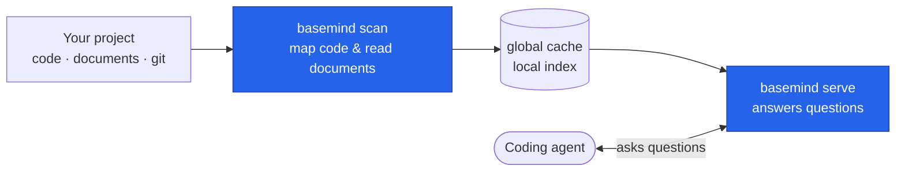

basemind turns your project into an always-current map through two simple steps: a one-time
parallel scan that reads everything, then a background daemon that answers questions in milliseconds.
When files change, it updates only what's touched — no re-read of the whole codebase.

## The scan

`basemind scan` reads your project once, in parallel. It maps your code with
[tree-sitter](https://tree-sitter.github.io/tree-sitter/) across
[300+ languages](https://github.com/Goldziher/tree-sitter-language-pack) and extracts text from
your documents using [xberg](https://github.com/xberg-io/xberg), then saves the results to a local
global cache (never inside your repo).

This happens once at setup, then incrementally as you work: when you open a file editor, basemind
detects the change and re-indexes only that file.

### Structure extraction

The scan builds a structural index: for each file, it extracts the symbols (functions, classes,
types), their signatures, their line/column positions, and what they call — all without running
the code. This is tree-sitter's job: it parses source code into an abstract syntax tree (AST),
and basemind runs hand-tuned queries over that tree to find the pieces you care about.

### Document extraction

If you have PDFs, Office documents, HTML, email, or images, basemind extracts their text (with
OCR for images) and indexes their content for semantic search.

## The server

`basemind serve` is a thin stdio relay: it makes sure the machine-global daemon is up and
forwards your client's MCP traffic to it. The daemon is the single writer of the index and hosts
the read side for every session. Code questions answer in milliseconds: "Where is `parseQuery`
defined?", "What calls `processFile`?", "Show me the outline of this file."

Each tool call resolves to a lookup in the index, not a re-read of the project. Memory use is
bounded rather than proportional to the repo: decoded outlines live in an LRU cache capped by
`[resources] max_map_cache_mb`, symbol and import names in a compact resident term index, and
callee and trait names in small resident dictionaries, with the rest read from the on-disk index
on demand. `references`, `callers` and `implementations` are scanned inside the daemon, so a
session holds no copy of the call graph. See [Memory and resources](/reference/memory/).

## Re-scans

When you edit code, basemind detects the change and re-scans the affected file. Other files stay
unchanged. This means keeping the index fresh as you work costs far less than the initial scan.

## Index lifecycle and freshness

`basemind serve` answers the MCP handshake immediately and warms the code map into memory in the
background, so a client never blocks waiting for a large repo to load. `admin status` reports
`warming` (still loading) and, once done, `warm_ms`; a first-time index build similarly reports
`indexing` / `index_build_ms`.

While the server isn't fully ready, `admin status` and every code-map read tool may carry a
`notice` object — `{ state, message, retry }` — instead of (or alongside) their normal result:

| `state` | Meaning | `retry` |
|---|---|---|
| `warming_up` | Loading an existing index into memory. | `true` |
| `building_index` | Indexing from scratch (no index for this workspace yet). | `true` |
| `rescanning` | Incremental rescan after a file change; results are usable but may be stale. | `false` |

Treat an empty or partial result carrying a `notice` as "retry shortly," not "no matches" — poll
`admin status` (or just retry the call) until the notice clears.

## Code versus documents

The code map holds code only. Prose, data and configuration files (Markdown, reStructuredText,
AsciiDoc, JSON, YAML, TOML, XML, CSV, INI, `.env`, diffs and the like) are routed to the document
tier instead: chunked, embedded and searched as text with `memory documents`, never listed as
symbols. That keeps `code outline`, `code symbols` and `code grep` free of README headings and
config keys. `[documents] include` / `exclude` and `mime_allowlist` decide which of those files are
indexed; with the `documents` feature compiled out they fall back to the code map.

Markdown notes and Obsidian vaults are therefore searched by meaning and by keyword, and a decision
record such as `docs/adr/0007-*.md` still resolves as a graph decision node.

## Vector search and memory

Search and memory (semantic search over documents and stored notes) are powered by
[LanceDB](https://github.com/lancedb/lancedb), an in-process vector database. When you call
`memory documents`, basemind compares your query against the embeddings of every document chunk
and returns the closest matches by meaning, not just by keywords.

The shared memory store works the same way: agents can write notes with `memory put`, and other
agents search that memory with `memory search` using semantic similarity.

